# 🏗️ Aura Shop - Complete System Architecture Documentation

## 📋 Table of Contents

- [🎯 Executive Summary](#-executive-summary)
- [🏗️ High-Level Architecture](#️-high-level-architecture)
- [🔄 Data Flow Analysis](#-data-flow-analysis)
- [🗄️ Database Architecture](#️-database-architecture)
- [🔐 Security Architecture](#-security-architecture)
- [🎨 Frontend Architecture](#-frontend-architecture)
- [⚡ Performance Architecture](#-performance-architecture)
- [📱 Mobile Architecture](#-mobile-architecture)
- [🔮 Scalability Design](#-scalability-design)
- [🛠️ DevOps Architecture](#️-devops-architecture)
- [📊 Monitoring & Observability](#-monitoring--observability)
- [🚀 Future Architecture Evolution](#-future-architecture-evolution)

## 🎯 Executive Summary

Aura Shop is architected as a **modern, scalable e-commerce platform** using a **microservice-ready monolithic architecture**. The system is designed for horizontal scaling, supporting multiple user types (customers, vendors, admins) with role-based access control and real-time features.

### 🏆 Key Architectural Principles

- **Separation of Concerns**: Clear boundaries between frontend, backend, and data layers
- **Role-Based Security**: Multi-tenant architecture with granular permissions
- **API-First Design**: RESTful APIs enabling multiple frontend implementations
- **Mobile-First**: Responsive web with native mobile app capabilities
- **Scalability Ready**: Designed for horizontal scaling and microservices migration
- **Developer Experience**: Modern tooling and clear documentation

## 🏗️ High-Level Architecture

### 🌐 System Overview


### 🏗️ Container Architecture


### 🔧 Component Architecture


## 🔄 Data Flow Analysis

### 🛒 E-commerce Transaction Flow


### 🔐 Authentication & Authorization Flow


### 🏪 Vendor Operations Flow


## 🗄️ Database Architecture

### 📊 Entity Relationship Diagram


### 🔍 Database Indexing Strategy


**Index Implementation:**

```javascript
// MongoDB Index Creation Commands
db.users.createIndex({ "email": 1 }, { unique: true });
db.users.createIndex({ "role": 1 });
db.users.createIndex({ "loginAttempts": 1 }, { 
  partialFilterExpression: { "loginAttempts": { $gt: 0 } }
});

db.products.createIndex({ "user": 1, "isActive": 1 });
db.products.createIndex({ "categories": 1, "isActive": 1 });
db.products.createIndex({ "name": "text", "description": "text", "brand": "text" });
db.products.createIndex({ "variants.sku": 1 }, { 
  unique: true, 
  partialFilterExpression: { 
    "variants.sku": { $exists: true, $type: "string", $ne: "" }
  }
});

db.orders.createIndex({ "user": 1, "createdAt": -1 });
db.orders.createIndex({ "orderNumber": 1 }, { unique: true });
db.orders.createIndex({ "status": 1, "createdAt": -1 });

db.categories.createIndex({ "name": 1 }, { unique: true });
db.categories.createIndex({ "slug": 1 }, { unique: true });
db.categories.createIndex({ "parentId": 1, "position": 1 });

db.carts.createIndex({ "user": 1 }, { unique: true });
db.carts.createIndex({ "expiresAt": 1 }, { expireAfterSeconds: 0 });

db.reviews.createIndex({ "productId": 1, "rating": 1 });
db.reviews.createIndex({ "userId": 1, "createdAt": -1 });
```

### 💾 Data Storage Patterns


## 🔐 Security Architecture

### 🛡️ Defense in Depth Strategy


### 🔑 Authentication Architecture


### 🔒 Role-Based Access Control (RBAC)


**Permission Implementation:**

```javascript
// Role-based middleware factory
const requireRole = (roles) => {
  return (req, res, next) => {
    if (!req.user) {
      return res.status(401).json({ message: 'Authentication required' });
    }
    
    if (!roles.includes(req.user.role)) {
      return res.status(403).json({ 
        message: `Access denied. Required role: ${roles.join(' or ')}` 
      });
    }
    
    next();
  };
};

// Resource ownership middleware
const requireOwnership = (resourceModel, resourceParam = 'id') => {
  return async (req, res, next) => {
    try {
      const resource = await resourceModel.findById(req.params[resourceParam]);
      
      if (!resource) {
        return res.status(404).json({ message: 'Resource not found' });
      }
      
      // Admin can access any resource
      if (req.user.role === 'admin' || req.user.role === 'super_admin') {
        req.resource = resource;
        return next();
      }
      
      // Check ownership
      if (resource.user?.toString() !== req.user._id.toString()) {
        return res.status(403).json({ message: 'Access denied - not resource owner' });
      }
      
      req.resource = resource;
      next();
    } catch (error) {
      res.status(500).json({ message: 'Authorization check failed' });
    }
  };
};

// Usage in routes
router.get('/products', protect, requireRole(['vendor', 'admin']), getProducts);
router.put('/products/:id', 
  protect, 
  requireRole(['vendor', 'admin']), 
  requireOwnership(Product), 
  updateProduct
);
```

## 🎨 Frontend Architecture

### 🏗️ Vue.js Application Structure

```mermaid
graph TB
    subgraph "Application Layer"
        A["🎯 main.js\nApp Bootstrap"]
        B["📱 App.vue\nRoot Component"]
        C["🗺️ Router\nNavigation Management"]
        D["🏪 Store (Pinia)\nState Management"]
    end
    
    subgraph "Feature Modules"
        E["🔐 Authentication\nLogin, Register, Profile"]
        F["🛒 Shopping\nProducts, Cart, Checkout"]
        G["📦 Orders\nHistory, Tracking, Returns"]
        H["🏪 Vendor\nDashboard, Analytics, Inventory"]
        I["👑 Admin\nUsers, Products, System"]
    end
    
    subgraph "Shared Layer"
        J["🧩 Components\nReusable UI Elements"]
        K["🎨 Layouts\nPage Templates"]
        L["🌐 Services\nAPI Communication"]
        M["🛠️ Utils\nHelper Functions"]
        N["🎯 Composables\nReactive Logic"]
    end
    
    A --> B
    B --> C
    B --> D
    
    C --> E
    C --> F
    C --> G
    C --> H
    C --> I
    
    E --> J
    F --> J
    G --> J
    H --> J
    I --> J
    
    E --> K
    F --> K
    G --> K
    
    E --> L
    F --> L
    G --> L
    H --> L
    I --> L
    
    J --> M
    J --> N
```



### 📱 Component Architecture


### 🔄 State Management Architecture


**Pinia Store Structure:**

```javascript
// stores/auth.js
export const useAuthStore = defineStore('auth', {
  state: () => ({
    user: null,
    token: localStorage.getItem('token'),
    isLoading: false,
    loginAttempts: 0,
    accountLocked: false
  }),
  
  getters: {
    isAuthenticated: (state) => !!state.token && !!state.user,
    isVendor: (state) => state.user?.role === 'vendor',
    isAdmin: (state) => ['admin', 'super_admin'].includes(state.user?.role),
    canAccessAdmin: (state) => state.user?.role === 'admin'
  },
  
  actions: {
    async login(credentials) {
      this.isLoading = true;
      try {
        const response = await authService.login(credentials);
        this.setAuth(response.data);
        this.loginAttempts = 0;
        return response;
      } catch (error) {
        this.loginAttempts++;
        if (this.loginAttempts >= 5) {
          this.accountLocked = true;
        }
        throw error;
      } finally {
        this.isLoading = false;
      }
    },
    
    setAuth(authData) {
      this.user = authData.user;
      this.token = authData.token;
      localStorage.setItem('token', authData.token);
      localStorage.setItem('user', JSON.stringify(authData.user));
    },
    
    logout() {
      this.user = null;
      this.token = null;
      localStorage.removeItem('token');
      localStorage.removeItem('user');
      // Clear other stores
      const cartStore = useCartStore();
      cartStore.$reset();
    }
  }
});

// stores/cart.js
export const useCartStore = defineStore('cart', {
  state: () => ({
    items: [],
    totalItems: 0,
    totalPrice: 0,
    isLoading: false,
    lastSynced: null
  }),
  
  getters: {
    itemCount: (state) => state.items.reduce((sum, item) => sum + item.quantity, 0),
    subtotal: (state) => state.items.reduce((sum, item) => sum + (item.price * item.quantity), 0),
    hasItems: (state) => state.items.length > 0
  },
  
  actions: {
    async fetchCart() {
      if (!this.isAuthenticated) return;
      
      this.isLoading = true;
      try {
        const response = await cartService.getCart();
        this.items = response.data.items;
        this.updateTotals();
        this.lastSynced = Date.now();
      } catch (error) {
        console.error('Failed to fetch cart:', error);
      } finally {
        this.isLoading = false;
      }
    },
    
    async addItem(product, variant, quantity = 1) {
      // Optimistic update
      const existingItem = this.items.find(item => 
        item.productId === product._id && item.variantSku === variant.sku
      );
      
      if (existingItem) {
        existingItem.quantity += quantity;
      } else {
        this.items.push({
          productId: product._id,
          variantSku: variant.sku,
          name: product.name,
          price: variant.price,
          quantity,
          image: variant.images?.[0] || product.images?.[0]
        });
      }
      
      this.updateTotals();
      
      // Sync with backend
      try {
        await cartService.addItem(product._id, variant.sku, quantity);
      } catch (error) {
        // Revert optimistic update
        if (existingItem) {
          existingItem.quantity -= quantity;
        } else {
          this.items.pop();
        }
        this.updateTotals();
        throw error;
      }
    },
    
    updateTotals() {
      this.totalItems = this.itemCount;
      this.totalPrice = this.subtotal;
    }
  }
});
```

## ⚡ Performance Architecture

### 🚀 Frontend Optimization Strategy


### 🗃️ Caching Architecture


**Cache Strategy Implementation:**

```javascript
// Redis caching middleware
const cacheMiddleware = (keyGenerator, ttl = 300) => {
  return async (req, res, next) => {
    const cacheKey = keyGenerator(req);
    
    try {
      const cachedData = await redis.get(cacheKey);
      
      if (cachedData) {
        res.set('X-Cache', 'HIT');
        return res.json(JSON.parse(cachedData));
      }
      
      // Intercept res.json to cache the response
      const originalJson = res.json;
      res.json = function(data) {
        redis.setex(cacheKey, ttl, JSON.stringify(data));
        res.set('X-Cache', 'MISS');
        originalJson.call(this, data);
      };
      
      next();
    } catch (error) {
      console.error('Cache middleware error:', error);
      next(); // Continue without cache on error
    }
  };
};

// Cache key generators
const productCacheKey = (req) => {
  const { category, page = 1, limit = 20, search = '' } = req.query;
  return `products:category:${category}:page:${page}:limit:${limit}:search:${search}`;
};

// Usage in routes
router.get('/products', 
  cacheMiddleware(productCacheKey, 300), // 5 minutes
  getProducts
);

// Cache invalidation on product updates
const invalidateProductCache = async (productId) => {
  const product = await Product.findById(productId).populate('categories');
  
  // Invalidate category-based cache
  for (const category of product.categories) {
    const pattern = `products:category:${category._id}:*`;
    const keys = await redis.keys(pattern);
    if (keys.length > 0) {
      await redis.del(keys);
    }
  }
  
  // Invalidate search cache
  const searchPattern = `products:*:search:*`;
  const searchKeys = await redis.keys(searchPattern);
  if (searchKeys.length > 0) {
    await redis.del(searchKeys);
  }
};
```

## 📱 Mobile Architecture

### 📲 Capacitor Integration


**Capacitor Configuration:**

```json
// capacitor.config.json
{
  "appId": "com.aurashop.app",
  "appName": "Aura Shop",
  "webDir": "dist",
  "bundledWebRuntime": false,
  "plugins": {
    "SplashScreen": {
      "launchShowDuration": 2000,
      "backgroundColor": "#3b82f6",
      "showSpinner": true,
      "spinnerColor": "#ffffff"
    },
    "StatusBar": {
      "style": "DARK",
      "backgroundColor": "#ffffff"
    },
    "Keyboard": {
      "resize": "ionic"
    },
    "PushNotifications": {
      "presentationOptions": ["badge", "sound", "alert"]
    },
    "LocalNotifications": {
      "smallIcon": "ic_stat_icon_config_sample",
      "iconColor": "#488AFF"
    }
  },
  "ios": {
    "scheme": "Aura Shop",
    "contentInset": "automatic"
  },
  "android": {
    "allowMixedContent": true,
    "webContentsDebuggingEnabled": true
  }
}
```

### 📡 Offline Architecture


## 🔮 Scalability Design

### 📈 Horizontal Scaling Architecture


### 🚀 Auto-Scaling Configuration

```yaml
# Kubernetes HPA Configuration
apiVersion: autoscaling/v2
kind: HorizontalPodAutoscaler
metadata:
  name: aura-shop-api-hpa
spec:
  scaleTargetRef:
    apiVersion: apps/v1
    kind: Deployment
    name: aura-shop-api
  minReplicas: 3
  maxReplicas: 20
  metrics:
  - type: Resource
    resource:
      name: cpu
      target:
        type: Utilization
        averageUtilization: 70
  - type: Resource
    resource:
      name: memory
      target:
        type: Utilization
        averageUtilization: 80
  - type: Pods
    pods:
      metric:
        name: requests_per_second
      target:
        type: AverageValue
        averageValue: "100"
  behavior:
    scaleUp:
      stabilizationWindowSeconds: 60
      policies:
      - type: Percent
        value: 100
        periodSeconds: 15
      - type: Pods
        value: 2
        periodSeconds: 60
    scaleDown:
      stabilizationWindowSeconds: 300
      policies:
      - type: Percent
        value: 10
        periodSeconds: 60
```

### 🌍 Multi-Region Deployment

```mermaid
flowchart TB
    subgraph "US East Region"
        A1["API Cluster US-East"]
        B1["MongoDB Replica US-East"]
        C1["Redis Cluster US-East"]
        D1["CDN Edge US-East"]
    end
    
    subgraph "Europe Region"
        A2["API Cluster EU-West"]
        B2["MongoDB Replica EU-West"]
        C2["Redis Cluster EU-West"]
        D2["CDN Edge EU-West"]
    end
    
    subgraph "Asia Pacific Region"
        A3["API Cluster AP-South"]
        B3["MongoDB Replica AP-South"]
        C3["Redis Cluster AP-South"]
        D3["CDN Edge AP-South"]
    end
    
    subgraph "Global Services"
        E["Global Load Balancer\n(Route 53 / Cloudflare)"]
        F["Master Database\n(MongoDB Atlas Global)"]
        G["Object Storage\n(S3 Cross-Region Replication)"]
    end
    
    E --> A1
    E --> A2
    E --> A3
    
    B1 <--> F
    B2 <--> F
    B3 <--> F
    
    A1 --> D1
    A2 --> D2
    A3 --> D3
    
    D1 --> G
    D2 --> G
    D3 --> G
```

## 🛠️ DevOps Architecture

### 🔄 CI/CD Pipeline

```mermaid
flowchart LR
    subgraph "Development"
        A["👨‍💻 Developer\nCommit Code"]
        B["🔀 GitHub\nSource Control"]
    end
    
    subgraph "CI Pipeline"
        C["⚡ GitHub Actions\nTrigger Build"]
        D["🧪 Run Tests\nUnit + Integration"]
        E["🔍 Code Quality\nESLint + SonarQube"]
        F["🔒 Security Scan\nSnyk + OWASP"]
        G["📦 Build Artifacts\nDocker Images"]
    end
    
    subgraph "CD Pipeline"
        H["🚀 Deploy Staging\nKubernetes"]
        I["🤖 E2E Tests\nCypress + Playwright"]
        J["📊 Performance Tests\nK6 + Lighthouse"]
        K["✅ Manual QA\nApproval Gate"]
        L["🌍 Production Deploy\nBlue-Green"]
    end
    
    subgraph "Monitoring"
        M["📈 Metrics\nPrometheus + Grafana"]
        N["📋 Logging\nELK Stack"]
        O["🚨 Alerting\nPagerDuty"]
    end
    
    A --> B
    B --> C
    C --> D
    D --> E
    E --> F
    F --> G
    G --> H
    H --> I
    I --> J
    J --> K
    K --> L
    L --> M
    L --> N
    L --> O
```

### 🐳 Container Architecture

```dockerfile
# Multi-stage Dockerfile for API
FROM node:18-alpine AS base
WORKDIR /app
COPY package*.json ./
RUN npm ci --only=production && npm cache clean --force

FROM base AS dev
RUN npm ci
COPY . .
CMD ["npm", "run", "dev"]

FROM base AS build
COPY . .
RUN npm run build 2>/dev/null || echo "No build script found"

FROM base AS production
COPY --from=build /app .
RUN addgroup -g 1001 -S nodejs && adduser -S nodejs -u 1001
USER nodejs
EXPOSE 5000
HEALTHCHECK --interval=30s --timeout=3s --start-period=5s --retries=3 \
    CMD node healthcheck.js
CMD ["npm", "start"]
```

```yaml
# Kubernetes Deployment
apiVersion: apps/v1
kind: Deployment
metadata:
  name: aura-shop-api
  labels:
    app: aura-shop-api
spec:
  replicas: 3
  selector:
    matchLabels:
      app: aura-shop-api
  template:
    metadata:
      labels:
        app: aura-shop-api
    spec:
      containers:
      - name: api
        image: aurashop/api:latest
        ports:
        - containerPort: 5000
        env:
        - name: NODE_ENV
          value: "production"
        - name: MONGO_URI
          valueFrom:
            secretKeyRef:
              name: aura-shop-secrets
              key: mongo-uri
        - name: JWT_SECRET
          valueFrom:
            secretKeyRef:
              name: aura-shop-secrets
              key: jwt-secret
        resources:
          requests:
            memory: "256Mi"
            cpu: "200m"
          limits:
            memory: "512Mi"
            cpu: "500m"
        livenessProbe:
          httpGet:
            path: /health
            port: 5000
          initialDelaySeconds: 30
          periodSeconds: 10
        readinessProbe:
          httpGet:
            path: /health/ready
            port: 5000
          initialDelaySeconds: 5
          periodSeconds: 5
```

## 📊 Monitoring & Observability

### 📈 Metrics Architecture

```mermaid
graph TB
    subgraph "Data Sources"
        A1["📱 Frontend Metrics\nCore Web Vitals, Errors"]
        A2["🔧 API Metrics\nLatency, Throughput, Errors"]
        A3["🗄️ Database Metrics\nQueries, Connections, Locks"]
        A4["🏗️ Infrastructure\nCPU, Memory, Network, Disk"]
    end
    
    subgraph "Collection Layer"
        B1["📊 Prometheus\nMetrics Aggregation"]
        B2["📋 Fluentd\nLog Aggregation"]
        B3["🔍 Jaeger\nDistributed Tracing"]
        B4["📱 Sentry\nError Tracking"]
    end
    
    subgraph "Processing Layer"
        C1["⚡ InfluxDB\nTime Series Storage"]
        C2["🔍 Elasticsearch\nLog Storage & Search"]
        C3["📊 Grafana\nVisualization"]
        C4["🚨 AlertManager\nNotification Routing"]
    end
    
    subgraph "Alerting Layer"
        D1["📧 Email Alerts"]
        D2["📱 Slack Notifications"]
        D3["📞 PagerDuty"]
        D4["📊 Dashboard Alerts"]
    end
    
    A1 --> B1
    A2 --> B1
    A3 --> B1
    A4 --> B1
    
    A1 --> B2
    A2 --> B2
    A3 --> B2
    
    A2 --> B3
    A1 --> B4
    A2 --> B4
    
    B1 --> C1
    B2 --> C2
    B3 --> C2
    
    C1 --> C3
    C2 --> C3
    
    B1 --> C4
    C4 --> D1
    C4 --> D2
    C4 --> D3
    C3 --> D4
```

### 🎯 Key Performance Indicators (KPIs)

```mermaid
dashboard
    title Aura Shop - Performance Dashboard
    
    metric1: API Response Time
    value1: 45ms
    trend1: down
    
    metric2: Order Conversion Rate
    value2: 3.2%
    trend2: up
    
    metric3: Cart Abandonment
    value3: 68%
    trend3: down
    
    metric4: Active Users
    value4: 1,247
    trend4: up
    
    metric5: Error Rate
    value5: 0.1%
    trend5: stable
    
    metric6: Database Queries/sec
    value6: 156
    trend6: up
```

**Monitoring Configuration:**

```yaml
# Prometheus Configuration
global:
  scrape_interval: 15s
  evaluation_interval: 15s

rule_files:
  - "rules/*.yml"

scrape_configs:
  - job_name: 'aura-shop-api'
    static_configs:
      - targets: ['api:5000']
    metrics_path: '/metrics'
    scrape_interval: 10s
    
  - job_name: 'mongodb'
    static_configs:
      - targets: ['mongodb-exporter:9216']
    
  - job_name: 'redis'
    static_configs:
      - targets: ['redis-exporter:9121']
    
  - job_name: 'node-exporter'
    static_configs:
      - targets: ['node-exporter:9100']

alerting:
  alertmanagers:
    - static_configs:
        - targets: ['alertmanager:9093']
```

```yaml
# Alert Rules
groups:
- name: aura-shop-alerts
  rules:
  - alert: HighErrorRate
    expr: rate(http_requests_total{status=~"5.."}[5m]) > 0.05
    for: 2m
    labels:
      severity: critical
    annotations:
      summary: "High error rate detected"
      description: "Error rate is {{ $value }} errors per second"
      
  - alert: HighResponseTime
    expr: histogram_quantile(0.95, rate(http_request_duration_seconds_bucket[5m])) > 1
    for: 5m
    labels:
      severity: warning
    annotations:
      summary: "High response time detected"
      description: "95th percentile response time is {{ $value }}s"
      
  - alert: DatabaseConnectionsHigh
    expr: mongodb_connections{state="current"} / mongodb_connections{state="available"} > 0.8
    for: 2m
    labels:
      severity: warning
    annotations:
      summary: "MongoDB connection usage high"
      description: "Connection usage is at {{ $value | humanizePercentage }}"
```

## 🚀 Future Architecture Evolution

### 🎯 Migration Roadmap

```mermaid
gantt
    title Architecture Evolution Timeline
    dateFormat YYYY-MM-DD
    section Phase 1: Optimization
    Performance Tuning      :done, p1-1, 2024-01-01, 2024-02-15
    Caching Implementation   :done, p1-2, 2024-02-01, 2024-03-15
    Security Hardening       :active, p1-3, 2024-03-01, 2024-04-15
    
    section Phase 2: Scaling
    Container Migration      :p2-1, 2024-04-01, 2024-05-15
    Kubernetes Deployment    :p2-2, 2024-05-01, 2024-06-15
    Auto-scaling Setup       :p2-3, 2024-06-01, 2024-07-15
    
    section Phase 3: Microservices
    Service Decomposition    :p3-1, 2024-07-01, 2024-09-15
    Event-Driven Architecture:p3-2, 2024-08-15, 2024-10-15
    Message Queue Integration:p3-3, 2024-09-15, 2024-11-15
    
    section Phase 4: Advanced Features
    AI/ML Integration        :p4-1, 2024-10-01, 2024-12-15
    Real-time Features       :p4-2, 2024-11-01, 2025-01-15
    Global Distribution      :p4-3, 2024-12-01, 2025-02-15
```

### 🏗️ Microservices Target Architecture

```mermaid
C4Container
    title Future Microservices Architecture
    
    Container_Boundary(gateway, "API Gateway Layer") {
        Container(api_gateway, "API Gateway", "Kong/Envoy", "Traffic routing, auth, rate limiting")
        Container(service_mesh, "Service Mesh", "Istio", "Inter-service communication")
    }
    
    Container_Boundary(auth, "Authentication Service") {
        Container(auth_service, "Auth Service", "Node.js", "JWT, OAuth, RBAC")
        ContainerDb(auth_db, "Auth Database", "PostgreSQL", "Users, roles, sessions")
    }
    
    Container_Boundary(catalog, "Product Catalog Service") {
        Container(product_service, "Product Service", "Node.js", "Product CRUD, search")
        Container(category_service, "Category Service", "Node.js", "Category management")
        ContainerDb(catalog_db, "Catalog DB", "MongoDB", "Products, categories")
        Container(search_service, "Search Service", "Elasticsearch", "Product search")
    }
    
    Container_Boundary(order, "Order Management Service") {
        Container(cart_service, "Cart Service", "Node.js", "Shopping cart operations")
        Container(order_service, "Order Service", "Node.js", "Order processing")
        Container(payment_service, "Payment Service", "Node.js", "Payment processing")
        ContainerDb(order_db, "Order DB", "PostgreSQL", "Orders, payments")
        ContainerDb(cart_cache, "Cart Cache", "Redis", "Session carts")
    }
    
    Container_Boundary(vendor, "Vendor Management Service") {
        Container(vendor_service, "Vendor Service", "Node.js", "Vendor operations")
        Container(analytics_service, "Analytics Service", "Python", "Business intelligence")
        ContainerDb(analytics_db, "Analytics DB", "ClickHouse", "Metrics, events")
    }
    
    Container_Boundary(notification, "Notification Service") {
        Container(email_service, "Email Service", "Node.js", "Email notifications")
        Container(push_service, "Push Service", "Node.js", "Push notifications")
        Container(message_queue, "Message Queue", "RabbitMQ", "Async messaging")
    }
    
    Rel(api_gateway, auth_service, "Validates", "HTTP/gRPC")
    Rel(api_gateway, product_service, "Routes", "HTTP")
    Rel(api_gateway, cart_service, "Routes", "HTTP")
    Rel(api_gateway, vendor_service, "Routes", "HTTP")
    
    Rel(product_service, search_service, "Indexes", "HTTP")
    Rel(cart_service, product_service, "Validates", "gRPC")
    Rel(order_service, payment_service, "Processes", "gRPC")
    
    Rel(order_service, message_queue, "Publishes", "AMQP")
    Rel(email_service, message_queue, "Subscribes", "AMQP")
    Rel(push_service, message_queue, "Subscribes", "AMQP")
    
    Rel(analytics_service, order_db, "Reads", "SQL")
    Rel(analytics_service, catalog_db, "Reads", "MongoDB")
```

### 🌟 Advanced Features Roadmap

```mermaid
mindmap
  root)Aura Shop Future(
    AI & Machine Learning
      Recommendation Engine
        Collaborative Filtering
        Content-based Filtering
        Hybrid Approach
      Demand Forecasting
        Inventory Optimization
        Price Optimization
      Fraud Detection
        Transaction Analysis
        Behavioral Patterns
      Chatbot Integration
        Customer Support
        Product Discovery
    
    Real-time Features
      Live Chat
        Customer Support
        Sales Assistance
      Push Notifications
        Order Updates
        Promotional Offers
      Live Inventory
        Stock Updates
        Price Changes
      Real-time Analytics
        User Behavior
        Sales Metrics
    
    Advanced E-commerce
      Multi-vendor Marketplace
        Vendor Onboarding
        Commission Management
      Subscription Commerce
        Recurring Orders
        Subscription Management
      B2B Portal
        Bulk Ordering
        Corporate Accounts
      International Expansion
        Multi-currency
        Multi-language
    
    Technology Evolution
      Edge Computing
        CDN Integration
        Edge Functions
      Serverless Architecture
        Function as a Service
        Event-driven Processing
      Blockchain Integration
        Supply Chain Tracking
        Loyalty Programs
      AR/VR Features
        Product Visualization
        Virtual Try-on
```

---

## 📝 Conclusion

This comprehensive system architecture documentation provides a complete blueprint for the Aura Shop e-commerce platform. The architecture is designed to be:

- **🔄 Evolutionary**: Starting with a monolithic structure that can evolve into microservices
- **📈 Scalable**: Horizontal scaling capabilities with auto-scaling support
- **🔒 Secure**: Multi-layered security with authentication, authorization, and data protection
- **⚡ Performant**: Optimized for speed with caching, CDN, and efficient database design
- **📱 Mobile-Ready**: Cross-platform support with responsive web and native mobile apps
- **🔍 Observable**: Comprehensive monitoring, logging, and alerting systems
- **🚀 Future-Proof**: Designed for emerging technologies and changing requirements

**Next Steps:**
1. Review and validate architectural decisions with the development team
2. Implement the current architecture optimizations
3. Plan the migration phases based on business priorities
4. Establish monitoring and performance baselines
5. Begin the evolution toward the target microservices architecture

---

*This architecture documentation is a living document that should be updated as the system evolves and new requirements emerge.*

**Last Updated**: October 21, 2025  
**Version**: 2.0  
**Next Review**: November 21, 2025