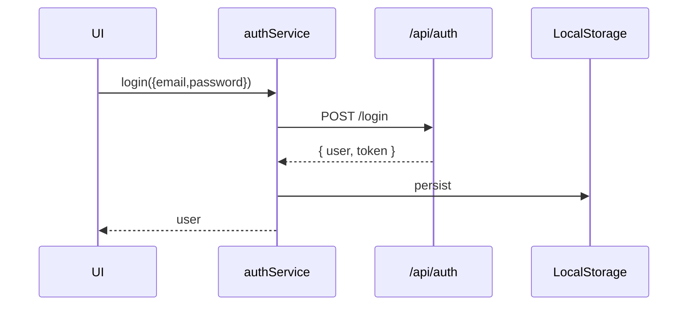
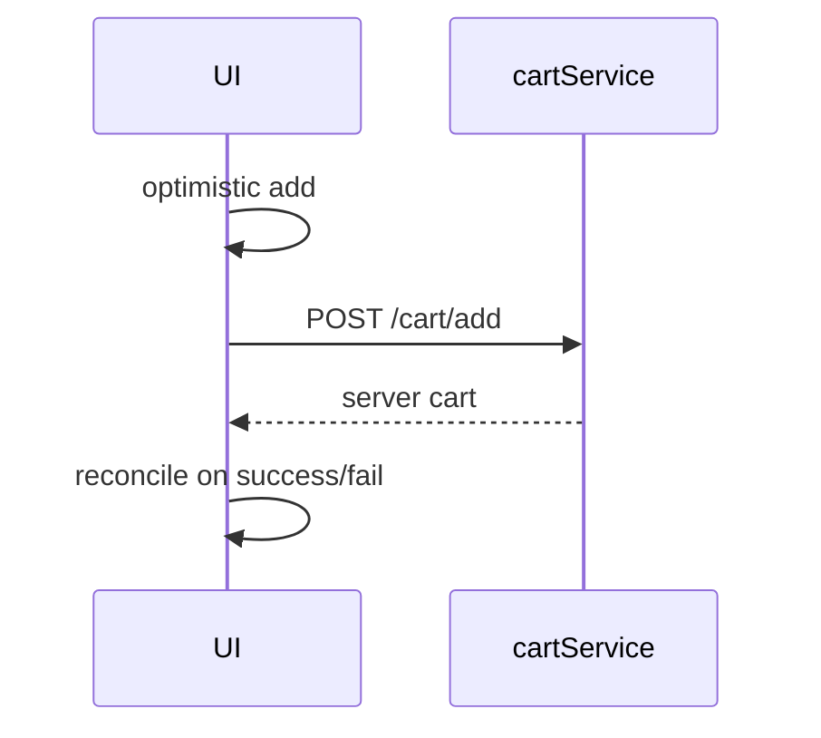
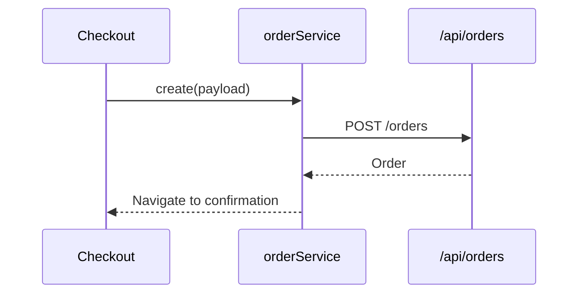
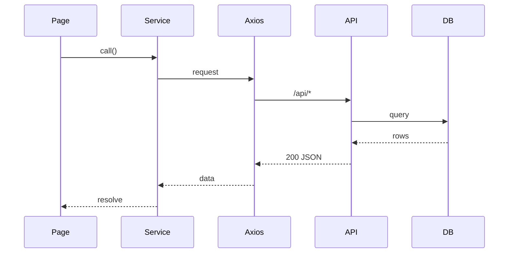
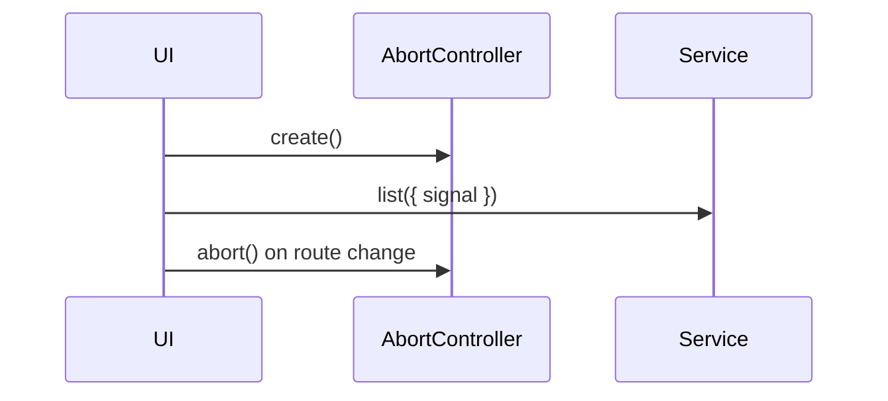

# Frontend Client Services — Developer Documentation (Extended Edition)

This is an expanded, implementation-ready guide to all services in metainflu/frontend/client/src/services. It includes:
- Per-file responsibilities, contracts, examples, and anti-patterns
- Full axios migration with typed JSDoc, interceptors, retries, cancellation
- Error taxonomy and normalization
- Security and performance guidance
- Visual diagrams for each service and cross-cutting flows
- Testing blueprints (MSW + Vitest) and fixtures

Table of contents
1) Architecture & conventions
2) Shared http client (axios)
3) Error model & handling
4) Auth service
5) Product service
6) Category service
7) Cart service
8) Order service
9) Vendor service (optional)
10) Influencer service (legacy)
11) Cross-cutting diagrams
12) Testing: MSW + Vitest
13) Security & privacy
14) Performance & UX
15) Migration checklist
16) Appendix: Types, fixtures, and snippets

---
## 1) Architecture & conventions

Goals
- Single-responsibility modules; no side effects at import time
- Stable request/response contracts; normalize errors
- Env-driven baseURL; never hardcode URLs in services
- Token injection at http layer; services are oblivious to auth storage
- Cancellable requests (AbortController)
- Idempotency for payment/order writes

Naming
- Services: lowerCamel plural or domain (productService)
- Methods: list/get/create/update/remove verbs
- Boolean flags: auth=false for public endpoints

Return shape
- Either domain objects or paged envelopes: { data, page, pageSize, total }

---
## 2) Shared http client (axios)

Create a small wrapper around axios for consistency.

File: src/services/http.js
```js
import axios from 'axios';

const BASE = import.meta.env.VITE_API_BASE_URL || 'http://localhost:5000';
export const http = axios.create({
  baseURL: `${BASE}/api`,
  timeout: 15000,
  headers: { 'Content-Type': 'application/json' },
});

// Request interceptor: auth header, request id, abort support
http.interceptors.request.use((cfg) => {
  // Add Authorization if token exists
  const raw = localStorage.getItem('user');
  const user = raw ? JSON.parse(raw) : null;
  if (user?.token && cfg.headers && !cfg.headers.Authorization) {
    cfg.headers.Authorization = `Bearer ${user.token}`;
  }
  // Assign a request id for logging/tracing
  cfg.headers['X-Request-Id'] = crypto?.randomUUID?.() || Math.random().toString(36).slice(2);
  return cfg;
});

// Response interceptor: normalize errors; 401 handling
http.interceptors.response.use(
  (res) => res,
  (err) => {
    const status = err?.response?.status;
    const message = err?.response?.data?.message || err.message || 'Request failed';
    const code = err?.code || 'HTTP_ERROR';

    // Global 401 handling: clear user and optionally redirect
    if (status === 401) {
      try { localStorage.removeItem('user'); } catch {}
      // Optionally: window.location.assign('/login');
    }

    return Promise.reject({ status, message, code, details: err?.response?.data || null });
  }
);

// Helper for cancellation
export function withAbort(signal) {
  return { signal };
}
```

Retries (optional)
```js
// Example: simple manual retry wrapper
export async function withRetry(fn, { retries = 2, delay = 250 } = {}) {
  let lastErr;
  for (let i = 0; i <= retries; i++) {
    try { return await fn(); } catch (e) { lastErr = e; if (i < retries) await new Promise(r => setTimeout(r, delay)); }
  }
  throw lastErr;
}
```

---
## 3) Error model & handling

Error taxonomy
- NetworkError: no response (offline, CORS, DNS)
- HttpError: response with non-2xx status
- ValidationError: 400 with field errors { fieldErrors: { field: msg } }
- AuthError: 401/403
- RateLimitError: 429
- ServerError: 5xx

Normalize to a common shape
```ts
/**
 * @typedef {Object} ServiceError
 * @property {number|undefined} status
 * @property {string} message
 * @property {string} code
 * @property {any} details
 */
```

Usage at callsites
```js
try {
  const { data } = await productService.list({ page:1 });
} catch (e) {
  // e: ServiceError
  toast.error(e.message);
}
```

---
## 4) Auth service

File: src/services/authService.js (axios version)
```js
import { http } from './http';

const prefix = '/auth';

/**
 * @typedef {Object} User
 * @property {string} _id
 * @property {string} name
 * @property {string} email
 * @property {('user'|'vendor'|'admin')} role
 * @property {string} token
 */

/** @param {{name:string,email:string,password:string}} payload */
export async function register(payload) {
  const res = await http.post(`${prefix}/register`, payload, { headers: { 'X-Op': 'register' }, auth: false });
  const user = res.data; try { localStorage.setItem('user', JSON.stringify(user)); } catch {}
  return user;
}

/** @param {{email:string,password:string}} payload */
export async function login(payload) {
  const res = await http.post(`${prefix}/login`, payload, { headers: { 'X-Op': 'login' }, auth: false });
  const user = res.data; try { localStorage.setItem('user', JSON.stringify(user)); } catch {}
  return user;
}

export function logout() { try { localStorage.removeItem('user'); } catch {} }

// Optional extras
export async function requestPassword(email) { return (await http.post(`${prefix}/request-password`, { email })).data; }
export async function resetPassword(token, password) { return (await http.post(`${prefix}/reset-password/${token}`, { password })).data; }
```

Diagram: login flow


Improvements
- Switch to HttpOnly cookies + CSRF token (backend change)
- Add refresh-token flow: /auth/refresh returning new access token
- Track lastLogin, mfaRequired flags

---
## 5) Product service

File: src/services/productService.js
```js
import { http, withAbort } from './http';

/** @typedef {{ _id:string, name:string, images?:{url:string,altText?:string}[], variants?:{sku:string,price:number,stock:number}[], categories?:{_id:string,name:string}[] }} Product */

/** @param {{ category?:string, page?:number, limit?:number, q?:string, signal?:AbortSignal }} params */
export async function list({ category='All', page=1, limit=20, q='', signal } = {}) {
  const res = await http.get('/products', { params: { category, page, limit, q }, ...withAbort(signal) });
  return { data: res.data, page, limit, total: Number(res.headers['x-total-count'] || res.data.length) };
}

/** @param {string} id */
export async function get(id, { signal } = {}) {
  const res = await http.get(`/products/${id}`, withAbort(signal));
  return res.data;
}
```

Diagram: product search
```mermaid
flowchart LR
  FilterUI -->|debounced q| list()
  list --> http
  http --> /api/products
```

Improvements
- Support field selection: fields=name,images to reduce payload
- Server-driven pagination + total count header
- Cache recent queries (LRU in-memory) with TTL

---
## 6) Category service

File: src/services/categoryService.js
```js
import { http } from './http';

export async function list() {
  const res = await http.get('/categories', { auth: false });
  return res.data;
}
```

Diagram


Improvements
- Cache in Pinia store; refresh every 12h

---
## 7) Cart service

File: src/services/cartService.js
```js
import { http } from './http';

export const get = async () => (await http.get('/cart')).data;
export const add = async (productId, quantity=1, attrs={}) => (await http.post('/cart/add', { productId, quantity, ...attrs })).data;
export const update = async (itemId, patch) => (await http.put(`/cart/update/${itemId}`, patch)).data;
export const remove = async (itemId) => (await http.delete(`/cart/remove/${itemId}`)).data;
export const clear = async () => (await http.delete('/cart')).data;
```

Diagram: optimistic add-to-cart


Improvements
- Idempotency key header for add to prevent duplicates on retry
- Merge local guest cart on login

---
## 8) Order service

File: src/services/orderService.js
```js
import { http } from './http';

export const create = async (payload) => (await http.post('/orders', payload)).data;
export const mine = async () => (await http.get('/orders/myorders')).data;
export const get = async (id) => (await http.get(`/orders/${id}`)).data;
export const pay = async (id, payment) => (await http.put(`/orders/${id}/pay`, payment)).data;
```

Diagram: checkout


Improvements
- Use server-calculated totals only; distrust client totals
- Webhooks for payment status changes

---
## 9) Vendor service (optional in customer app)

File: src/services/vendorService.js
```js
import { http } from './http';
export const profile = async (id) => (await http.get(`/vendor/profile/${id}`)).data;
export const products = async (vendorId, params) => (await http.get(`/vendor/products/${vendorId}`, { params })).data;
```

Diagram


Improvements
- Guard calls in client by role when relevant; always enforce on server

---
## 10) Influencer service (legacy)
- If not used, mark deprecated and schedule removal.

---
## 11) Cross-cutting diagrams

End-to-end


Error normalization
```mermaid
flowchart TD
  RawErr[Axios error] --> Parse[Extract status/message]
  Parse --> Shape[{status,message,code,details}]
  Shape --> Caller[Callsite shows toast/logs]
```

Cancellation


---
## 12) Testing: MSW + Vitest

Setup
```bash
npm i -D msw vitest @vitest/ui @testing-library/vue whatwg-fetch
```

handlers.js
```js
import { rest } from 'msw';
const BASE = (import.meta.env.VITE_API_BASE_URL || 'http://localhost:5000') + '/api';
export const handlers = [
  rest.post(`${BASE}/auth/login`, (req, res, ctx) => res(ctx.json({ _id:'u1', name:'A', email:'a@b.c', role:'user', token:'t' }))),
  rest.get(`${BASE}/products`, (req, res, ctx) => res(ctx.set('x-total-count','1'), ctx.json([{ _id:'p1', name:'P' }]))),
];
```

service.test.ts
```ts
import { setupServer } from 'msw/node';
import { handlers } from './handlers';
import * as auth from '@/services/authService';

const server = setupServer(...handlers);
beforeAll(()=>server.listen());
afterEach(()=>server.resetHandlers());
afterAll(()=>server.close());

test('login stores user', async () => {
  const user = await auth.login({ email:'a@b.c', password:'x' });
  expect(user.token).toBeTruthy();
  expect(JSON.parse(localStorage.getItem('user')||'null')).toBeTruthy();
});
```

---
## 13) Security & privacy
- Prefer HttpOnly cookies + CSRF for auth (backend work)
- Don’t log PII; mask emails in logs
- Use Content-Security-Policy to reduce XSS risk (in index.html)
- Encrypt local persisted data if keeping user beyond token

---
## 14) Performance & UX
- Debounce search inputs; cancel previous requests
- Preload critical routes using router prefetch
- Use HTTP caching headers for categories; implement ETag
- Lazy-load large pages and chart libs

---
## 15) Migration checklist (fetch -> axios)
- [ ] Add http.js and interceptors
- [ ] Update each service to use http
- [ ] Remove duplicate base URLs
- [ ] Add 401 global handling
- [ ] Add cancellation to list/search methods
- [ ] Add tests with MSW

---
## 16) Appendix: Types & fixtures

Common types (JSDoc)
```ts
/** @typedef {{_id:string,name:string}} Category */
/** @typedef {{sku:string,price:number,stock:number}} Variant */
/** @typedef {{url:string,altText?:string}} Image */
/** @typedef {{_id:string,name:string,images?:Image[],variants?:Variant[],categories?:Category[]}} Product */
/** @typedef {{_id:string,items:any[],total:number,status:string}} Order */
```

Fixtures (tests)
```js
export const fxUser = { _id:'u1', name:'User', email:'u@e.com', role:'user', token:'tok' };
export const fxProduct = { _id:'p1', name:'Tee', images:[{url:'/img.png'}], variants:[{sku:'sku1',price:9.99,stock:5}] };
```

---
Last updated: Oct 2025
