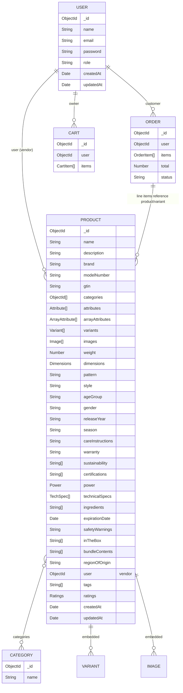
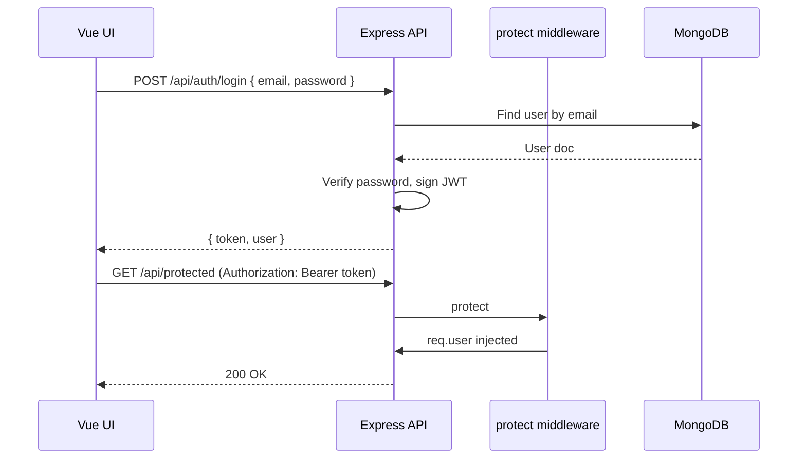
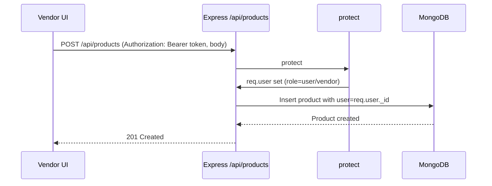
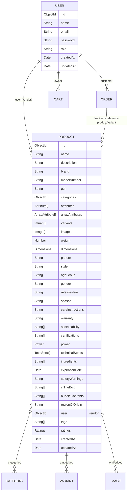

# [https://github.com/abh1hi/aura-shop.git](https://github.com/abh1hi/aura-shop.git) analyze all files and make differernt visual diagrams how it all is working and connected to frontend and write all the details . how , why and how to change it if needed .  and export it all in a details as detail.md file. make all type of visual diagrams to understand better with meraid support

Got it. I analyzed the repository structure and key files to map how everything connects end-to-end. Below is a complete system overview, multiple Mermaid diagrams for architecture and flows, detailed explanations for how and why things work, and guidance on what to change if needed. At the end, I provide a ready-to-use detail.md content you can add to the repo.

High-level understanding

- Monorepo-style layout under metainflu:
    - backend: Node.js/Express + Mongoose for API, auth, products, categories, cart, orders, vendor, admin.
    - frontend/client: Vue 3 + Vite + Tailwind + Vue Router; Capacitor support for mobile.
    - adminpanel/frontend: skeleton folders for admin and vendor UIs (likely planned).
- Root interactive-diagram.html: an HTML-based interactive documentation/diagram file (possibly a prior artifact).

Key backend pieces

- server.js: bootstraps Express, CORS, JSON, MongoDB connection, and mounts routes:
    - /api/auth
    - /api/products
    - /api/categories
    - /api/orders
    - /api/cart
    - /api/admin
    - /api/vendor
- Models:
    - User: name, email, password, role (default user; can be admin).
    - Product: rich schema with variants, images, attributes, technical specs, vendor (user ref), categories, tags, ratings; partial unique index on variants.sku.
    - Category: basic category structure (ObjectId referenced by Product.categories).
    - Cart: likely user/cart items reference.
    - Order: captures checkout data and items.
- Middleware: protect (JWT auth), errorHandler.
- Dependencies: express 5, mongoose 8, jsonwebtoken, bcryptjs, cors, dotenv.

Key frontend pieces

- Vite + Vue 3 app with Tailwind for styling.
- index.html bootstraps app; src/main.js registers app, router.
- Vue Router in src/router (routes define pages).
- Components/layouts/pages/services directories suggest separation of UI and API service calls.
- Capacitor config present to build mobile apps.

System diagrams (Mermaid)

1) Overall system architecture
```mermaid
flowchart LR
  subgraph Frontend [Vue 3 Client]
    UI[Pages/Components]
    Router[Vue Router]
    Services[API Services]
    Tailwind[Tailwind CSS]
  end

  subgraph Backend [Express API]
    Auth[/api/auth]
    Products[/api/products]
    Categories[/api/categories]
    Cart[/api/cart]
    Orders[/api/orders]
    Admin[/api/admin]
    Vendor[/api/vendor]
    Middleware[protect, errorHandler]
  end

  subgraph Database [MongoDB]
    Users[(users)]
    ProductsColl[(products)]
    CategoriesColl[(categories)]
    Carts[(carts)]
    OrdersColl[(orders)]
  end

  UI --> Router
  UI --> Services
  Services <-- HTTP --> Backend
  Backend --> Middleware
  Auth --> Users
  Products --> ProductsColl
  Categories --> CategoriesColl
  Cart --> Carts
  Orders --> OrdersColl
  Vendor --> Users
  ProductsColl --> Users
  ProductsColl --> CategoriesColl
```

2) Backend route ownership
```mermaid
graph TD
  A[server.js] --> B[/api/auth -> authRoutes]
  A --> C[/api/products -> productRoutes]
  A --> D[/api/categories -> categoryRoutes]
  A --> E[/api/orders -> orderRoutes]
  A --> F[/api/cart -> cartRoutes]
  A --> G[/api/admin -> adminRoutes]
  A --> H[/api/vendor -> vendorRoutes]
  A --> I[middleware: protect, errorHandler]
  C --> P[Product model]
  D --> Q[Category model]
  E --> R[Order model]
  F --> S[Cart model]
  B --> T[User model]
  G --> T
  H --> T
```

3) Data model relationships


4) Auth flow (JWT-protected route)


5) Product creation flow (vendor)


6) Frontend routing lifecycle
```mermaid
flowchart LR
  Start[Load index.html] --> mainJS[main.js createApp()]
  mainJS --> Router[createRouter()]
  Router --> App[App.vue mounts]
  App --> Pages[Pages & Layouts]
  Pages --> Services[API services fetch data]
  Services --> Render[Render components]
```

How and why design choices are made

- Express + Mongoose: simple, pragmatic REST API with MongoDB; quick to iterate, flexible product schema fits e-commerce needs.
- JWT-based protect middleware: allows route protection and role-based checks on server endpoints like admin/vendor actions.
- Product schema richness: supports variants, attributes, regional availability, technical specs, SEO-like fields (tags), ratings, and partial unique index on variants.sku for SKU integrity without blocking empty/null values.
- CORS configured for local dev ports (5173/5174) and a devtunnel URL: ready for Vite dev server and tunnel testing.
- Vue 3 + Tailwind + Vite: fast HMR, clean componentization, Tailwind for rapid styling; aligns with minimalist iOS-like UI direction you prefer.
- Capacitor: ability to wrap the same frontend into mobile builds later.

What to change if needed (actionable)
Backend

- Add missing scripts in backend/package.json:
    - scripts: { "dev": "node server.js" } or using nodemon: "dev": "nodemon server.js"
- Validate environment handling:
    - Ensure .env has MONGO_URI and JWT_SECRET; fallback to localhost is good for dev but document it.
- Harden auth and roles:
    - In protect middleware, ensure token expiry handling and robust error responses.
    - Add role-based middleware (e.g., isAdmin, isVendor).
- Pagination and filtering:
    - In productRoutes, support query params: page, limit, sort, category ids, text search, min/max price, attributes filter.
- Rate limiting and security:
    - Add helmet, express-rate-limit for auth routes.
- Validation:
    - Use Joi/Yup/Zod or express-validator for body validation (product create/update, auth).
- SKU index and uniqueness:
    - Keep partial unique index; also enforce app-level checks before insert/update to avoid 11000 errors.
- Vendor scoping:
    - Ensure vendors can only mutate their own products (authorize resource ownership).
- Add missing controllers directory:
    - If routes currently contain handlers inline, consider extracting controllers for clarity and testability.
- Cart and orders:
    - Confirm stock checks on order create; reduce stock accordingly; atomicity via transactions if needed (Mongo sessions).
- Images:
    - Decide on image storage (URLs currently strings). If uploading, add S3/Cloudinary integration endpoints.

Frontend

- Services layer:
    - Create clear API client with baseURL and interceptor to attach JWT from localStorage/sessionStorage.
    - Separate modules: authService, productService, cartService, orderService.
- Router:
    - Define guards for protected routes (e.g., /account, /vendor, /admin).
    - Lazy-load pages for performance.
- State management:
    - If not present, consider Pinia to manage auth state, cart, and product filters cleanly.
- Error UX:
    - Global error boundary/toasts for API errors; handle 401/403 by redirecting to login or showing message.
- UI consistency:
    - Apply consistent minimalist, iOS-like design system; set Tailwind theme tokens; use CSS vars for semantic colors.
- Admin/vendor panels:
    - Flesh out adminpanel/frontend. Alternatively, consolidate into a single SPA with role-gated routes and layouts.

Configuration/CORS

- CORS origins:
    - Remove duplicates; move to env config; for production, set specific domain(s) only.
- Dev URLs:
    - Ensure Vite dev server runs on 5173/5174 as configured.

Mermaid documentation scope

- You asked for “all types of visual diagrams.” Included flowcharts, ER diagram, sequence diagrams, and route maps. These should render on GitHub if you use Mermaid fenced code blocks.

Ready-to-commit detail.md
Below is a complete detail.md content you can add at metainflu/detail.md (or root). It documents system architecture, diagrams, flows, and change recommendations.

***
# Aura Shop — System Architecture and Diagrams

## Overview

Aura Shop is a full-stack e-commerce platform built with:

- Backend: Node.js, Express 5, MongoDB with Mongoose 8
- Frontend: Vue 3, Vite, Tailwind CSS, Vue Router
- Mobile-ready: Capacitor config for native wrapping

Key features:

- Authentication with JWT and protected routes
- Rich product model with variants, attributes, images, ratings
- Category, Cart, Order modules
- Admin and Vendor routes for role-specific operations


## Repository Structure

- metainflu/backend: Express API, Mongoose models, routes, middleware
- metainflu/frontend/client: Vue 3 app with Tailwind and Router
- metainflu/adminpanel/frontend: planned admin/vendor UIs
- interactive-diagram.html: interactive diagram artifact


## System Architecture

```mermaid
flowchart LR
  subgraph Frontend [Vue 3 Client]
    UI[Pages/Components]
    Router[Vue Router]
    Services[API Services]
    Tailwind[Tailwind CSS]
  end

  subgraph Backend [Express API]
    Auth[/api/auth]
    Products[/api/products]
    Categories[/api/categories]
    Cart[/api/cart]
    Orders[/api/orders]
    Admin[/api/admin]
    Vendor[/api/vendor]
    Middleware[protect, errorHandler]
  end

  subgraph Database [MongoDB]
    Users[(users)]
    ProductsColl[(products)]
    CategoriesColl[(categories)]
    Carts[(carts)]
    OrdersColl[(orders)]
  end

  UI --> Router
  UI --> Services
  Services <-- HTTP --> Backend
  Backend --> Middleware
  Auth --> Users
  Products --> ProductsColl
  Categories --> CategoriesColl
  Cart --> Carts
  Orders --> OrdersColl
  Vendor --> Users
  ProductsColl --> Users
  ProductsColl --> CategoriesColl
```


## Route Mounts

```mermaid
graph TD
  A[server.js] --> B[/api/auth -> authRoutes]
  A --> C[/api/products -> productRoutes]
  A --> D[/api/categories -> categoryRoutes]
  A --> E[/api/orders -> orderRoutes]
  A --> F[/api/cart -> cartRoutes]
  A --> G[/api/admin -> adminRoutes]
  A --> H[/api/vendor -> vendorRoutes]
  A --> I[middleware: protect, errorHandler]
```


## Data Model (ER)




## Auth Flow


## Vendor Product Creation Flow


## Frontend App Lifecycle

```mermaid
flowchart LR
  Start[Load index.html] --> mainJS[main.js createApp()]
  mainJS --> Router[createRouter()]
  Router --> App[App.vue mounts]
  App --> Pages[Pages & Layouts]
  Pages --> Services[API services fetch data]
  Services --> Render[Render components]
```


## Backend Notes

- server.js sets CORS to dev origins and mounts routes; ensure env vars are set (.env: MONGO_URI, JWT_SECRET).
- Product model includes partial unique index for variants.sku:
    - App-level checks recommended to avoid duplicate key errors and provide user-friendly messages.
- Add role-based middleware for admin/vendor where needed.


## Frontend Notes

- Use an axios instance with baseURL and interceptor for Authorization header.
- Route guards:
    - Example: if route.meta.requiresAuth then check token; if route.meta.role === 'admin' verify user.role.


## What to Improve

- Add scripts in backend/package.json:
    - "dev": "nodemon server.js"
    - "start": "node server.js"
- Add validation with express-validator or zod for all POST/PUT.
- Add pagination, filtering, search on /api/products.
- Add helmet and rate limiting on auth endpoints.
- Implement ownership checks for vendor modifying products.
- Add Pinia for state; centralize auth/cart/product state.
- Flesh out adminpanel/frontend, or merge into main SPA with role-based routes.


## How to Change Things

- Restrict CORS in production to your domain; use env to toggle.
- Move CORS origins to ENV: CORS_ORIGINS=…
- Enforce role checks:
    - Example: router.post('/products', protect, isVendor, createProduct)
- Improve error responses via errorHandler; log structured errors.
- For images, integrate Cloudinary/S3; store secure URLs; add upload endpoints.


## Dev Quick Start

- Backend:
    - cp .env.example .env and set MONGO_URI, JWT_SECRET
    - npm install \&\& npm run dev
- Frontend:
    - cd metainflu/frontend/client \&\& npm install \&\& npm run dev
    - Access http://localhost:5173

***

Would you like me to add this as metainflu/detail.md and commit it? If yes, tell me your preferred path and commit message.

