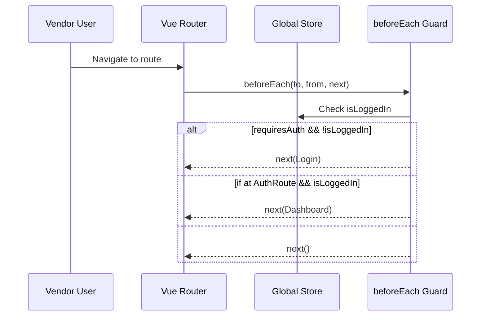
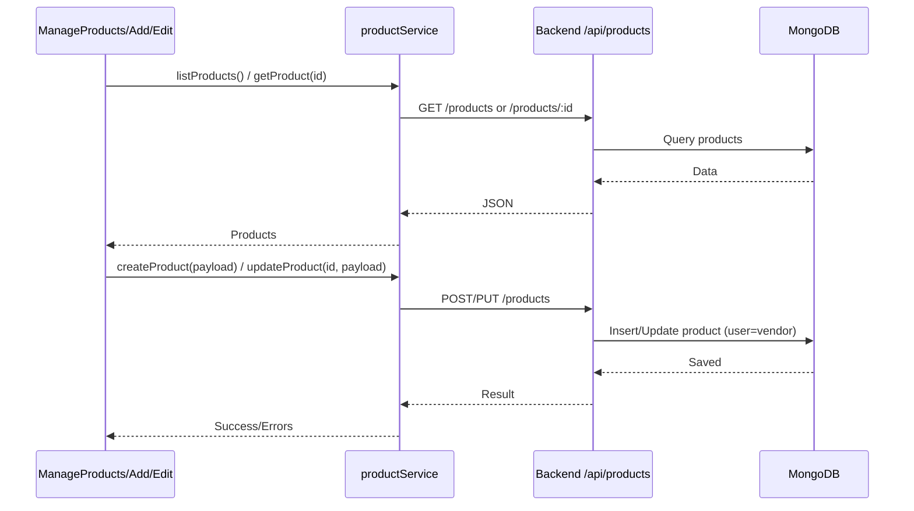

Below is a comprehensive, developer-focused documentation for the vendor panel at metainflu/adminpanel/frontend/vendor. It includes technologies used, architecture, file-by-file map, how pieces connect to the backend, “why” design choices, how to modify/extend, and multiple Mermaid diagrams (flowcharts, sequence diagrams, ER/context diagrams) to visualize data and runtime flows. You can save this content as vendor-docs.md.

Title: Aura Shop Vendor Panel — Architecture, Diagrams, and Developer Guide

Overview
The vendor panel is a mobile-first Vue 3 application (Vite + Tailwind) designed for product management, analytics, orders, invoicing, and vendor account operations. It communicates with the backend REST API (Express + MongoDB). It provides:

- Authentication (login/register/forgot password) and protected routes
- Product lifecycle features (list, add, edit)
- Order fulfillment and invoices
- Reports/analytics dashboards
- Notifications and tasks (scaffolding present)

Key Technologies and Why

- Vue 3: Modern, composition API-ready framework for reactive UIs and componentization.
- Vite: Very fast dev server and build system, first-class Vue support.
- Tailwind CSS: Utility-first styling to quickly implement a consistent, minimal, mobile-first design.
- Vue Router 4: Client-side routing with guards for auth.
- Axios: Centralized API client with token injection via interceptor.
- Chart.js: Visualization library for analytics (registered globally at app startup).

Directory Structure

- index.html — Root HTML template; mounts app to \#app and loads src/main.js.
- index.js — Module index and exports (components, router, styles, configs); also includes dev utility stubs.
- package.json — Scripts (dev/build/preview) and dependencies.
- tailwind.config.js — Custom theme (colors, fonts, shadows) tuned for a clean iOS-like design.
- vite.config.js, postcss.config.js — Build/styling tooling.
- public/ — Static assets root (favicons, etc).
- src/
    - main.js — App bootstrap, global store, router setup, global Chart.js register.
    - App.vue — Top-level shell with auth/no-auth layouts, mobile-first header/sidebar/bottom nav.
    - index.css, style.css — Tailwind base and custom styles.
    - router/
        - index.js — Route definitions, auth guards, meta titles, history base “/vendor”.
        - productRoutes.js — Optional route grouping for product flows (present as helper).
    - components/
        - Auth: VendorLogin.vue, VendorRegister.vue, ForgotPassword.vue
        - Layout: VendorMobileHeader.vue, VendorSidebar.vue, VendorBottomNav.vue, PageHeader.vue, VendorBreadcrumb.vue, VendorLoadingScreen.vue
        - Misc: HelloWorld.vue, NotFound.vue, VendorNotifications.vue, VendorPWAPrompt.vue
    - pages/
        - Dashboard: VendorPanel.vue
        - Reports: ReportsDashboard.vue, Analytics.vue
        - Tasks: MyTasks.vue
        - Products: ManageProducts.vue, AddProduct.vue, EditProduct.vue
        - Orders/Invoices: OrderFulfillment.vue, Invoices.vue
        - Sales: ViewSales.vue
        - Marketing: Notifications.vue
        - Onboarding: VendorLanding.vue
        - Account: Account.vue
    - services/
        - apiClient.js — Axios instance with base URL and Authorization header injector.
        - authService.js — Login/Register/Logout flows; token and user persistence.
        - productService.js — CRUD operations for products.
        - orderService.js — Order-related requests.
        - categoryService.js — Category queries for product categorization.
        - cartService.js — Provided for parity (lightly used in panel).
        - vendorService.js — Vendor profile/config requests.
        - adminService.js — Utilities overlapping with admin features (can be restricted).

How Things Connect

Rendering and Navigation

1. index.html loads src/main.js, which creates and mounts the app.
2. main.js:
    - Creates app from App.vue
    - Registers Vue Router
    - Registers Chart.js globally
    - Provides a simple global reactive store (auth state + user)
3. App.vue:
    - Detects if current route is an auth page (Login/Register/ForgotPassword)
    - If auth page: show auth layout
    - Else: renders mobile-first layout with mobile header, off-canvas sidebar, and bottom navigation; content via router-view.

Routing and Guards

- router/index.js defines routes for login/register/forgot-password and main vendor routes (dashboard, reports, tasks, products, etc.).
- A beforeEach guard:
    - Reads auth state from window.__globalStore (populated in main.js)
    - Enforces meta.requiresAuth
    - Redirects guests from protected routes to Login
    - Redirects logged-in users away from auth pages to Dashboard
- Titles are set via route meta.title.

API Communication

- apiClient.js sets baseURL = VITE_API_BASE_URL or http://localhost:5000, and uses /api as prefix.
- An interceptor pulls a token from localStorage keys (vendorUser, user, or vendorAuthToken) and sets Authorization: Bearer <token>.
- Services (authService, productService, orderService, etc.) import apiClient and expose domain-specific methods.

Data Modeling Touchpoints

- Products include vendor user reference, variants with SKUs, attributes, images, categories, etc. The vendor app components (AddProduct/EditProduct/ManageProducts) structure forms and tables around this shape.
- Orders for fulfillment workflows and invoices are fetched via orderService.
- Categories fill product forms (categoryService).

Mermaid Diagrams

1) Vendor App Architecture (Frontend only)
```mermaid
flowchart LR
  subgraph VendorApp [Vendor Vue 3 App]
    A[index.html] --> B[main.js]
    B --> C[App.vue]
    C --> D[Vue Router]
    C --> E[Tailwind CSS]
    D --> F[Pages & Components]
    F --> G[Services (Axios)]
  end

  G -->|HTTP| H[(Backend API)]
```

2) Route and Guard Flow


3) Services and API Client
```mermaid
flowchart LR
  subgraph Services
    AS[authService]
    PS[productService]
    OS[orderService]
    CS[categoryService]
    VS[vendorService]
  end
  AC[apiClient (Axios)] <--> Services
  AC -->|Authorization Bearer| API[(Backend /api)]
  LocalStorage[(localStorage)] --> AC
```

4) Product Management Flow


5) End-to-End Context Diagram
```mermaid
flowchart TB
  VendorUser[Vendor User] --mobile/desktop--> VendorUI[Vendor Panel (Vue)]
  VendorUI -->|Axios| VendorAPI[/api/vendor, /api/products, /api/orders, /api/categories]
  VendorAPI --> Mongo[(MongoDB)]
  VendorAPI -. JWT .-> VendorUI
  subgraph Backend
    VendorAPI
    Mongo
  end
```

Design Decisions and Rationale

- Mobile-first layout: Vendors often act on the go; bottom navigation and off-canvas sidebar simplify thumb reach and small-screen navigation.
- Lightweight global store: The vendor panel uses a minimal reactive object for auth state to avoid overhead; can be upgraded to Pinia if needed.
- Router guard sourcing auth from window.__globalStore: avoids import cycles and lets guards run without importing the store module.
- Centralized Axios client: Enforces a single place to set base URL and Authorization headers; easy to add retry/refresh logic later.
- Tailwind custom theme: Provides a distinct yet minimal palette (primary-blue, secondary-blue, gray scale, semantic colors) and consistent radii/shadows.
- Chart.js registered globally: Guarantees chart components can render without re-registering; simplifies small analytics use-cases.

How to Modify or Extend

1) Change API base URL

- Set VITE_API_BASE_URL in an .env file at the vendor frontend root:
    - Example: VITE_API_BASE_URL=https://your-api.example.com
- apiClient.js will use it automatically.

2) Switch to a formal state manager (Pinia)

- Install and create a store for auth/user/products.
- Replace global reactive store with Pinia store.
- Update router guard to import the Pinia store (avoiding circular deps by structuring store and router creation carefully).

3) Add/modify routes

- src/router/index.js: add new route objects with meta.requiresAuth if needed.
- Example:
    - {
path: '/coupons',
name: 'Coupons',
component: () => import('../pages/Coupons.vue'),
meta: { requiresAuth: true, title: 'Coupons' }
}

4) Add a new page

- Create src/pages/Coupons.vue.
- Register route as above.
- Fetch data via a new service (e.g., couponService.js).

5) Change login behavior and persistence

- src/services/authService.js: update login() to match backend response.
- src/main.js: adjust how vendor user is stored (vendorUser vs vendorAuthToken) to align with backend token shape.

6) Enhance security and UX

- Add refresh-token flows in apiClient response interceptor.
- Handle 401 by redirecting to login and clearing store.
- Add toast notifications for errors (e.g., Vue Toastification).

7) Theming and styles

- tailwind.config.js: update palette, radii, typography.
- src/style.css: add component-level utility classes and CSS variables for advanced theming.

8) Performance

- Use route-level code splitting with dynamic imports for heavy pages:
    - component: () => import('../pages/EditProduct.vue')
- Memoize expensive computed props or use virtual lists for large tables.

9) Integrate uploads (product images)

- Add a mediaService.js for uploads (to S3/Cloudinary).
- In AddProduct/EditProduct, handle file selection and send to upload endpoint, then store image URLs in product payload.

10) Lock vendor scope server-side

- Ensure backend vendor routes enforce ownership: a vendor can only modify products with product.user == vendor._id.
- In UI, hide edit/delete controls for non-owned products.

Developer Quickstart

Local Development

- Install:
    - cd metainflu/adminpanel/frontend/vendor
    - npm install
- Run dev server:
    - npm run dev
    - App served on http://localhost:5173 (ensure CORS in backend allows this)
- Build:
    - npm run build
- Preview production build:
    - npm run preview

Environment and Configuration

- Create a .env file with:
    - VITE_API_BASE_URL=http://localhost:5000
- Backend should allow CORS from http://localhost:5173.

Auth State and Storage

- main.js reads vendorUser (JSON) or vendorAuthToken (string) from localStorage.
- When integrating with backend auth, store a JSON object with token and user info:
    - localStorage.setItem('vendorUser', JSON.stringify({ token, user }))

Common Integration Points

- Product CRUD: src/pages/AddProduct.vue, EditProduct.vue, ManageProducts.vue via productService.js
- Orders/Invoices: src/pages/OrderFulfillment.vue, Invoices.vue via orderService.js
- Reports/Analytics: src/pages/ReportsDashboard.vue, Analytics.vue using Chart.js and your services
- Categories: src/services/categoryService.js for dropdowns and filters
- Vendor Profile: src/pages/Account.vue and vendorService.js

Code Snippets

Auth Guard Pattern (router/index.js)

```javascript
router.beforeEach((to, from, next) => {
  const store = window.__globalStore || { isLoggedIn: false };
  document.title = to.meta.title ? `${to.meta.title} | Subtracker Vendor` : 'Subtracker Vendor Panel';

  if (to.meta.requiresAuth && !store.isLoggedIn) next({ name: 'Login' });
  else if (['Login', 'Register', 'ForgotPassword'].includes(to.name) && store.isLoggedIn) next({ name: 'Dashboard' });
  else next();
});
```

Axios Token Injection (services/apiClient.js)

```javascript
api.interceptors.request.use((cfg) => {
  const raw = localStorage.getItem('vendorUser') || localStorage.getItem('user') || localStorage.getItem('vendorAuthToken');
  let token = null;
  if (raw) {
    try { const parsed = JSON.parse(raw); token = parsed?.token ?? parsed; } catch { token = raw; }
  }
  if (token) cfg.headers = { ...cfg.headers, Authorization: `Bearer ${token}` };
  return cfg;
});
```

Sample Product Service Calls (services/productService.js)

```javascript
import api from './apiClient';
export default {
  list(params)    { return api.get('/products', { params }); },
  get(id)         { return api.get(`/products/${id}`); },
  create(payload) { return api.post('/products', payload); },
  update(id,data) { return api.put(`/products/${id}`, data); },
  remove(id)      { return api.delete(`/products/${id}`); },
};
```

Testing Checklist

- Auth: Verify login redirects to dashboard; logout returns to login.
- Route guards: Protected pages are inaccessible when logged out.
- Product flows: List/add/edit/delete cycles succeed and reflect changes.
- Category population: AddProduct shows categories; filter products by category.
- Orders and invoices: Fetch lists; update fulfillment status.
- Analytics: Charts render; no console errors; responsive on mobile.
- CORS: All requests succeed from the Vite dev server host.

Troubleshooting

- 401 Unauthorized: Check token in localStorage and Authorization header; ensure backend JWT secret matches environment; verify protect middleware.
- CORS errors: Update backend CORS origins to include the vendor dev URL.
- Broken charts: Ensure Chart.js registerables registered in main.js.
- Route base issues: The router is configured with createWebHistory('/vendor/'); ensure your server serves this base path or adjust to createWebHistory() for root.

Release and Deployment Notes

- Build output via npm run build produces a dist folder.
- Serve dist with a static file server and ensure SPA fallback to index.html for router paths.
- If deployed under a subpath (e.g., /vendor), keep router base aligned or set VITE_BASE and router base consistently.

End of vendor-docs.md

If you want, I can generate and add this vendor-docs.md directly into metainflu/adminpanel/frontend/vendor with a commit message you choose.

