# Aura Shop Backend - Complete Technical Documentation

## 📋 Overview

The Aura Shop backend is a **Node.js REST API** built with Express.js and MongoDB, supporting a multi-tenant e-commerce platform with role-based access control. The architecture follows **MVC patterns** with clear separation of concerns across models, controllers, routes, and middleware layers.

## 🏗️ System Architecture

### High-Level Architecture Diagram


### Backend Component Flow


## 📁 Directory Structure Analysis

```
metainflu/backend/
├── config/
│   └── db.js                    # Database connection configuration
├── controllers/
│   ├── authController.js        # Authentication logic (login/register)
│   ├── productController.js     # Product CRUD operations
│   ├── orderController.js       # Order management
│   ├── cartController.js        # Shopping cart operations
│   ├── categoryController.js    # Category management
│   ├── vendorController.js      # Vendor-specific operations
│   └── adminController.js       # Admin-specific operations
├── middleware/
│   ├── authMiddleware.js        # JWT verification & role checks
│   └── errorMiddleware.js       # Global error handling
├── models/
│   ├── User.js                  # User schema with roles
│   ├── Product.js               # Complex product schema with variants
│   ├── Order.js                 # Order schema with items
│   ├── Cart.js                  # Shopping cart schema
│   └── Category.js              # Product category schema
├── routes/
│   ├── authRoutes.js            # Authentication endpoints
│   ├── productRoutes.js         # Product API endpoints
│   ├── orderRoutes.js           # Order API endpoints
│   ├── cartRoutes.js            # Cart API endpoints
│   ├── categoryRoutes.js        # Category API endpoints
│   ├── vendorRoutes.js          # Vendor API endpoints
│   └── adminRoutes.js           # Admin API endpoints
├── package.json                 # Dependencies and scripts
├── server.js                    # Main application entry point
├── .gitignore                   # Git ignore rules
├── MIGRATION.md                 # Database migration guide
└── session_summary.md           # Development session notes
```

## 🚀 Entry Point Analysis

### server.js - Application Bootstrap
```javascript
/*
 * Purpose: Main Express.js application entry point
 * Responsibilities:
 *   - Express app configuration
 *   - Middleware registration
 *   - Route mounting
 *   - Database connection
 *   - Error handling setup
 */
```

**Key Components:**


**Technology Stack:**
- **Express.js 5.1.0**: Latest stable version with performance improvements
- **Mongoose 8.18.0**: Modern ODM with better TypeScript support
- **CORS**: Configured for multiple frontend origins
- **dotenv**: Environment variable management

**CORS Configuration Analysis:**
```javascript
const corsOptions = {
  origin: [
    'http://localhost:5173',   // Vite dev server (customer)
    'http://127.0.0.1:5173',   
    'http://localhost:5174',   // Vite dev server (vendor)
    'http://127.0.0.1:5174',
    'https://3czzqk3l-5173.use2.devtunnels.ms' // Dev tunnel
  ],
  methods: ['GET', 'POST', 'PUT', 'DELETE', 'PATCH', 'OPTIONS'],
  allowedHeaders: ['Content-Type', 'Authorization'],
  credentials: true
};
```

**Issues Identified:**
- ❌ Hardcoded origins (should be environment-based)
- ❌ Duplicate origins in array
- ❌ Dev tunnel URL should not be in production

## 🗄️ Database Layer Deep Dive

### MongoDB Connection (config/db.js)

**Current Implementation:**
```javascript
const connectDB = async () => {
  try {
    const conn = await mongoose.connect('mongodb://localhost:27017/aura-shop', {
      useNewUrlParser: true,
      useUnifiedTopology: true,
    });
    console.log(`MongoDB Connected: ${conn.connection.host}`);
  } catch (error) {
    console.error(`Error: ${error.message}`);
    process.exit(1);
  }
};
```

**Issues & Improvements:**


```mermaid
graph LR
    subgraph "Current Issues"
        A["❌ Hardcoded Connection String"]
        B["❌ No Connection Pooling Config"]
        C["❌ No Retry Logic"]
        D["❌ No Health Check"]
    end
    
    subgraph "Recommended Improvements"
        E["✅ Environment-based URI"]
        F["✅ Connection Pool Settings"]
        G["✅ Automatic Reconnection"]
        H["✅ Health Check Endpoint"]
    end
    
    A --> E
    B --> F
    C --> G
    D --> H
```

**Improved Implementation:**
```javascript
const connectDB = async () => {
  try {
    const conn = await mongoose.connect(process.env.MONGO_URI || 'mongodb://localhost:27017/aura-shop', {
      useNewUrlParser: true,
      useUnifiedTopology: true,
      maxPoolSize: 50,        // Connection pool size
      serverSelectionTimeoutMS: 5000,
      socketTimeoutMS: 45000,
      family: 4              // Use IPv4
    });
    
    // Connection event listeners
    mongoose.connection.on('connected', () => {
      console.log('✅ MongoDB Connected successfully');
    });
    
    mongoose.connection.on('error', (err) => {
      console.error('❌ MongoDB connection error:', err);
    });
    
    mongoose.connection.on('disconnected', () => {
      console.log('⚠️ MongoDB disconnected');
    });
    
    return conn;
  } catch (error) {
    console.error(`❌ Database connection failed: ${error.message}`);
    process.exit(1);
  }
};
```

## 🧩 Models Architecture

### Entity Relationship Diagram


### User Model Analysis (models/User.js)

**Schema Definition:**
```javascript
const userSchema = mongoose.Schema({
  name: {
    type: String,
    required: [true, 'Please add a name'],
  },
  email: {
    type: String,
    required: [true, 'Please add an email'],
    unique: true,
  },
  password: {
    type: String,
    required: [true, 'Please add a password'],
  },
  role: {
    type: String,
    required: true,
    default: 'user', // 'user', 'vendor', 'admin'
  }
}, {
  timestamps: true,
});
```

**Strengths:**
- ✅ Simple, clean schema
- ✅ Built-in timestamps
- ✅ Required field validation
- ✅ Email uniqueness constraint

**Improvements Needed:**


### Product Model Analysis (models/Product.js)

**Complex Schema Highlights:**
```javascript
const productSchema = new mongoose.Schema({
  name: { type: String, required: true },
  variants: [variantSchema],  // Embedded subdocuments
  categories: [{
    type: mongoose.Schema.Types.ObjectId,
    ref: 'Category',
  }],
  images: [{
    url: { type: String },
    altText: { type: String },
    position: { type: Number },
    variantSku: { type: String, default: null }
  }],
  user: {
    type: mongoose.Schema.Types.ObjectId,
    ref: 'User',
    required: true,
  },
  // ... extensive product attributes
});

// Partial unique index for variant SKUs
productSchema.index(
  { 'variants.sku': 1 },
  { 
    unique: true, 
    partialFilterExpression: { 
      'variants.sku': { $exists: true, $type: 'string', $ne: '' } 
    } 
  }
);
```

**Key Features:**
- **Variants Support**: Multiple SKUs, prices, stock levels per product
- **Category Relationships**: Many-to-many with population
- **Image Management**: Supports variant-specific images
- **Vendor Ownership**: Products tied to vendor users
- **Rich Attributes**: Technical specs, dimensions, sustainability info

**Database Optimization:**


## 🎯 Controllers Deep Analysis

### Authentication Controller (controllers/authController.js)

**Core Functions Analysis:**


**Security Analysis:**
```javascript
// Current JWT generation (30-day expiration)
const generateToken = (id) => {
  return jwt.sign({ id }, process.env.JWT_SECRET, {
    expiresIn: '30d',
  });
};

// Current password hashing (salt rounds: 10)
const salt = await bcrypt.genSalt(10);
const hashedPassword = await bcrypt.hash(password, salt);
```

**Security Issues & Fixes:**
| Issue | Current State | Recommended Fix |
|-------|---------------|----------------|
| **JWT Expiration** | 30 days | 15 minutes access + 7 days refresh |
| **Password Policy** | None | Minimum 8 chars, complexity rules |
| **Rate Limiting** | None | 5 attempts per 15 minutes |
| **Account Lockout** | None | Lock after 5 failed attempts |
| **Input Validation** | Basic | Comprehensive schema validation |

### Product Controller (controllers/productController.js)

**Business Logic Flow:**


**Key Features:**
- **Dynamic Category Creation**: Auto-creates categories if they don't exist
- **Ownership Validation**: Vendors can only modify their own products
- **Flexible Filtering**: Category-based product filtering
- **Image Synchronization**: Links main images to variant-specific images
- **Rich Product Attributes**: Supports complex product specifications

**Performance Optimizations Needed:**


### Order Controller (controllers/orderController.js)

**Order Processing Workflow:**


**Business Logic Analysis:**
```javascript
// Server-side total calculation (security-first approach)
const subtotal = orderItems.reduce((acc, item) => 
  acc + item.price * item.quantity, 0);

// Dynamic shipping cost calculation
const shippingCost = subtotal > 100 ? 0 : 10.00;
const total = subtotal + shippingCost;

// Order creation with cart clearing
const createdOrder = await order.save();
await Cart.findByIdAndDelete(cart._id);
```

**Issues & Improvements:**
| Component | Current Issue | Improvement Needed |
|-----------|---------------|-------------------|
| **Inventory Check** | None | Validate stock before order |
| **Price Consistency** | Basic | Lock prices at order time |
| **Payment Integration** | Mock | Real payment gateway |
| **Order Notifications** | None | Email/SMS notifications |
| **Vendor Notifications** | None | Notify vendors of new orders |

## 🛡️ Middleware Analysis

### Authentication Middleware (middleware/authMiddleware.js)

**JWT Verification Flow:**


**Role-Based Access Control:**
```javascript
// Admin middleware
const admin = (req, res, next) => {
  if (req.user && req.user.role === 'admin') {
    next();
  } else {
    res.status(401);
    throw new Error('Not authorized as an admin');
  }
};

// Vendor middleware
const vendor = (req, res, next) => {
  if (req.user && req.user.role === 'vendor') {
    next();
  } else {
    res.status(401);
    throw new Error('Not authorized as a vendor');
  }
};
```

**Security Enhancements Needed:**


## 🛣️ Routes Architecture

### Route Structure Overview


### Route Protection Matrix

| Route | Method | Protection Level | Required Role | Purpose |
|-------|--------|------------------|---------------|---------|
| `/api/auth/register` | POST | None | - | User registration |
| `/api/auth/login` | POST | None | - | General login |
| `/api/auth/admin/login` | POST | None | admin | Admin login |
| `/api/auth/vendor/login` | POST | None | vendor | Vendor login |
| `/api/products` | GET | None | - | Browse products |
| `/api/products/:id` | GET | None | - | View product details |
| `/api/products` | POST | Protected | user+ | Create product |
| `/api/products/:id` | PUT | Protected + Owner | owner/admin | Update product |
| `/api/products/:id` | DELETE | Protected + Owner | owner/admin | Delete product |
| `/api/orders` | POST | Protected | user+ | Create order |
| `/api/orders/myorders` | GET | Protected | user+ | View own orders |
| `/api/orders/:id` | GET | Protected + Owner | owner/admin | View order details |
| `/api/cart` | GET | Protected | user+ | Get cart contents |
| `/api/cart/add` | POST | Protected | user+ | Add to cart |
| `/api/categories` | GET | None | - | List categories |
| `/api/admin/*` | ALL | Protected | admin | Admin operations |
| `/api/vendor/*` | ALL | Protected | vendor | Vendor operations |

## 🔧 Package.json Analysis

### Dependencies Deep Dive

```json
{
  "dependencies": {
    "bcryptjs": "^3.0.2",           // Password hashing
    "cors": "^2.8.5",               // Cross-origin requests
    "dotenv": "^17.2.1",            // Environment variables
    "express": "^5.1.0",            // Web framework
    "express-async-handler": "^1.2.0", // Async error handling
    "jsonwebtoken": "^9.0.2",       // JWT tokens
    "mongoose": "^8.18.0"           // MongoDB ODM
  }
}
```

**Dependency Security Analysis:**

```mermaid
graph LR
    subgraph "Security Status"
        A["✅ bcryptjs - Secure"]
        B["✅ cors - Updated"]
        C["✅ express - Latest"]
        D["⚠️ No input validation"]
        E["⚠️ No rate limiting"]
        F["⚠️ No helmet security"]
    end
    
    subgraph "Missing Dependencies"
        G["joi/yup - Input validation"]
        H["express-rate-limit"]
        I["helmet - Security headers"]
        J["morgan - Request logging"]
        K["compression - Response compression"]
    end
    
    D --> G
    E --> H
    F --> I
```


**Recommended Additional Dependencies:**
```json
{
  "dependencies": {
    // Existing dependencies...
    "helmet": "^7.1.0",              // Security headers
    "express-rate-limit": "^7.1.5",  // Rate limiting
    "joi": "^17.11.0",               // Input validation
    "morgan": "^1.10.0",             // HTTP request logging
    "compression": "^1.7.4",         // Gzip compression
    "express-validator": "^7.0.1",   // Alternative validation
    "redis": "^4.6.11",             // Caching and sessions
    "nodemailer": "^6.9.7",          // Email notifications
    "multer": "^1.4.5-lts.1",        // File upload handling
    "sharp": "^0.32.6"               // Image processing
  },
  "devDependencies": {
    "nodemon": "^3.0.1",             // Development server
    "jest": "^29.7.0",               // Testing framework
    "supertest": "^6.3.3",          // HTTP testing
    "eslint": "^8.54.0",             // Code linting
    "prettier": "^3.1.0"             // Code formatting
  }
}
```

## 🚨 Issues & Technical Debt

### Critical Issues

```mermaid
graph TD
    A["Critical Issues"] --> B["🔴 Security"]
    A --> C["🔴 Performance"]
    A --> D["🔴 Reliability"]
    A --> E["🔴 Maintainability"]
    
    B --> B1["Hardcoded secrets"]
    B --> B2["No input validation"]
    B --> B3["No rate limiting"]
    B --> B4["Long JWT expiration"]
    
    C --> C1["No database indexing"]
    C --> C2["No caching layer"]
    C --> C3["N+1 query problems"]
    C --> C4["No pagination"]
    
    D --> D1["No error logging"]
    D --> D2["No health checks"]
    D --> D3["No connection pooling"]
    D --> D4["No graceful shutdown"]
    
    E --> E1["No API documentation"]
    E --> E2["Inconsistent error handling"]
    E --> E3["No testing framework"]
    E --> E4["Missing TypeScript types"]
```



### Security Vulnerabilities

| Vulnerability | Risk Level | Current State | Mitigation |
|---------------|------------|---------------|------------|
| **Hardcoded Secrets** | 🔴 High | Connection string in code | Use environment variables |
| **No Input Validation** | 🔴 High | Basic validation only | Implement Joi/Yup schemas |
| **Long JWT Tokens** | 🟡 Medium | 30-day expiration | 15-minute access + refresh tokens |
| **No Rate Limiting** | 🟡 Medium | Unlimited requests | Express-rate-limit middleware |
| **Missing HTTPS** | 🟡 Medium | HTTP only | Force HTTPS in production |
| **No CORS Validation** | 🟡 Medium | Wildcard origins | Environment-specific origins |
| **Password Policy** | 🟡 Medium | No complexity rules | Enforce strong passwords |
| **No Account Lockout** | 🟡 Medium | Unlimited login attempts | Lock after 5 failed attempts |

## 🏆 Performance Optimization Plan

### Database Optimization


### Recommended Database Indexes

```javascript
// User collection indexes
db.users.createIndex({ "email": 1 }, { unique: true });
db.users.createIndex({ "role": 1 });
db.users.createIndex({ "createdAt": -1 });

// Product collection indexes
db.products.createIndex({ "categories": 1 });
db.products.createIndex({ "user": 1 });
db.products.createIndex({ "name": "text", "description": "text" });
db.products.createIndex({ "createdAt": -1 });
db.products.createIndex({ "variants.sku": 1 }, { 
  unique: true, 
  partialFilterExpression: { "variants.sku": { $ne: null } }
});

// Order collection indexes
db.orders.createIndex({ "user": 1 });
db.orders.createIndex({ "createdAt": -1 });
db.orders.createIndex({ "status": 1 });
db.orders.createIndex({ "user": 1, "createdAt": -1 });

// Cart collection indexes
db.carts.createIndex({ "user": 1 }, { unique: true });

// Category collection indexes
db.categories.createIndex({ "name": 1 }, { unique: true });
```

## 🔮 Improvement Roadmap

### Phase 1: Security & Stability (Weeks 1-4)


**Implementation Examples:**

```javascript
// Environment-based configuration
const config = {
  port: process.env.PORT || 5000,
  mongoUri: process.env.MONGO_URI || 'mongodb://localhost:27017/aura-shop',
  jwtSecret: process.env.JWT_SECRET,
  jwtExpire: process.env.JWT_EXPIRE || '15m',
  jwtRefreshExpire: process.env.JWT_REFRESH_EXPIRE || '7d',
  corsOrigins: process.env.CORS_ORIGINS?.split(',') || ['http://localhost:3000']
};

// Input validation middleware
const validateProduct = (req, res, next) => {
  const schema = Joi.object({
    name: Joi.string().min(3).max(100).required(),
    description: Joi.string().max(1000),
    price: Joi.number().positive().precision(2).required(),
    stock: Joi.number().integer().min(0).required()
  });
  
  const { error } = schema.validate(req.body);
  if (error) {
    return res.status(400).json({ message: error.details[0].message });
  }
  next();
};

// Rate limiting configuration
const authLimiter = rateLimit({
  windowMs: 15 * 60 * 1000, // 15 minutes
  max: 5, // 5 attempts per window
  message: 'Too many authentication attempts, please try again later',
  standardHeaders: true,
  legacyHeaders: false
});
```

### Phase 2: Performance & Scalability (Weeks 5-8)


### Phase 3: Advanced Features (Weeks 9-12)


## 🧪 Testing Strategy

### Testing Pyramid Implementation

```mermaid
graph TB
    subgraph "Testing Pyramid"
        A["🔵 Unit Tests (70%)\nFunctions, Utilities, Models"]
        B["🟡 Integration Tests (20%)\nAPI Endpoints, Database"]
        C["🟢 E2E Tests (10%)\nUser Workflows"]
    end
    
    A --> B --> C
    
    subgraph "Testing Tools"
        Jest["Jest - Unit Testing"]
        Supertest["Supertest - API Testing"]
        MongoDB["MongoDB Memory Server"]
        Cypress["Cypress - E2E Testing"]
    end
```

### Test Examples

```javascript
// Unit Test Example - User Model
describe('User Model', () => {
  test('should hash password before saving', async () => {
    const userData = {
      name: 'Test User',
      email: 'test@example.com',
      password: 'plainPassword',
      role: 'user'
    };
    
    const user = new User(userData);
    await user.save();
    
    expect(user.password).not.toBe('plainPassword');
    expect(user.password).toMatch(/^\$2[ayb]\$.{56}$/);
  });
});

// Integration Test Example - Auth API
describe('POST /api/auth/register', () => {
  test('should register a new user', async () => {
    const userData = {
      name: 'New User',
      email: 'new@example.com',
      password: 'StrongPassword123!'
    };
    
    const response = await request(app)
      .post('/api/auth/register')
      .send(userData)
      .expect(201);
    
    expect(response.body).toHaveProperty('token');
    expect(response.body.role).toBe('user');
  });
});

// E2E Test Example - Product Creation Flow
describe('Product Management Flow', () => {
  test('vendor should create, update, and delete product', async () => {
    // Login as vendor
    const loginResponse = await request(app)
      .post('/api/auth/vendor/login')
      .send({ email: 'vendor@example.com', password: 'password' });
    
    const token = loginResponse.body.token;
    
    // Create product
    const productData = {
      name: 'Test Product',
      description: 'Test Description',
      price: 99.99,
      stock: 50
    };
    
    const createResponse = await request(app)
      .post('/api/products')
      .set('Authorization', `Bearer ${token}`)
      .send(productData)
      .expect(201);
    
    const productId = createResponse.body._id;
    
    // Update product
    await request(app)
      .put(`/api/products/${productId}`)
      .set('Authorization', `Bearer ${token}`)
      .send({ name: 'Updated Product' })
      .expect(200);
    
    // Delete product
    await request(app)
      .delete(`/api/products/${productId}`)
      .set('Authorization', `Bearer ${token}`)
      .expect(200);
  });
});
```

## 📊 Monitoring & Observability

### Metrics to Track

```mermaid
graph TB
    subgraph "Application Metrics"
        A1["Request Rate (req/sec)"]
        A2["Response Time (ms)"]
        A3["Error Rate (%)"]
        A4["Active Users"]
    end
    
    subgraph "Database Metrics"
        B1["Query Response Time"]
        B2["Connection Pool Usage"]
        B3["Database Size"]
        B4["Index Performance"]
    end
    
    subgraph "Business Metrics"
        C1["Order Conversion Rate"]
        C2["Cart Abandonment"]
        C3["Product Views"]
        C4["User Registration"]
    end
    
    subgraph "Infrastructure Metrics"
        D1["CPU Usage"]
        D2["Memory Usage"]
        D3["Network I/O"]
        D4["Disk Usage"]
    end
```

### Health Check Implementation

```javascript
// Health check endpoints
app.get('/health', (req, res) => {
  res.status(200).json({
    status: 'healthy',
    timestamp: new Date().toISOString(),
    uptime: process.uptime(),
    version: process.env.npm_package_version
  });
});

app.get('/health/detailed', async (req, res) => {
  const health = {
    status: 'healthy',
    timestamp: new Date().toISOString(),
    services: {}
  };
  
  // Database health check
  try {
    await mongoose.connection.db.admin().ping();
    health.services.database = { status: 'healthy', responseTime: '< 10ms' };
  } catch (error) {
    health.services.database = { status: 'unhealthy', error: error.message };
    health.status = 'unhealthy';
  }
  
  // Redis health check (if implemented)
  try {
    const redis = require('./config/redis');
    await redis.ping();
    health.services.cache = { status: 'healthy' };
  } catch (error) {
    health.services.cache = { status: 'unhealthy', error: error.message };
  }
  
  const statusCode = health.status === 'healthy' ? 200 : 503;
  res.status(statusCode).json(health);
});
```

## 📈 Scalability Architecture

### Horizontal Scaling Plan

```mermaid
architecture-beta
    group lb(logos:nginx)[Load Balancer]
    group api(logos:nodejs)[API Instances]
    group cache(logos:redis)[Redis Cluster]
    group db(logos:mongodb)[MongoDB Replica Set]
    
    service nginx(logos:nginx)[Nginx LB] in lb
    service api1(logos:nodejs)[API Instance 1] in api
    service api2(logos:nodejs)[API Instance 2] in api
    service api3(logos:nodejs)[API Instance 3] in api
    
    service redis1(logos:redis)[Redis Primary] in cache
    service redis2(logos:redis)[Redis Replica] in cache
    
    service mongo1(logos:mongodb)[MongoDB Primary] in db
    service mongo2(logos:mongodb)[MongoDB Secondary 1] in db
    service mongo3(logos:mongodb)[MongoDB Secondary 2] in db
    
    nginx:R --> L:api1
    nginx:R --> L:api2
    nginx:R --> L:api3
    
    api1:B --> T:redis1
    api2:B --> T:redis1
    api3:B --> T:redis1
    
    api1:B --> T:mongo1
    api2:B --> T:mongo1
    api3:B --> T:mongo1
    
    redis1:R --> L:redis2
    mongo1:R --> L:mongo2
    mongo1:R --> L:mongo3
```

### Performance Benchmarks

| Metric | Current | Target (Phase 1) | Target (Phase 2) |
|--------|---------|------------------|------------------|
| **Response Time** | ~200ms | <100ms | <50ms |
| **Concurrent Users** | ~100 | ~1,000 | ~10,000 |
| **Database Queries/sec** | ~50 | ~500 | ~5,000 |
| **Memory Usage** | ~512MB | ~1GB | ~2GB |
| **CPU Usage** | ~20% | ~40% | ~60% |
| **Uptime** | 95% | 99% | 99.9% |

## 🎯 Next Steps & Action Items

### Immediate Actions (Week 1-2)

```mermaid
checklist-example
    title Immediate Priority Tasks
    □ Set up environment variables (.env file)
    □ Implement input validation with Joi
    □ Add rate limiting to auth routes
    □ Create database indexes
    □ Add request logging with Morgan
    □ Implement error handling middleware
    □ Set up basic health check endpoints
    □ Add CORS environment configuration
    □ Create refresh token system
    □ Add password complexity validation
```

### Short-term Goals (Month 1)

1. **Security Hardening**
   - Implement comprehensive input validation
   - Add rate limiting and account lockout
   - Set up refresh token authentication
   - Configure security headers with Helmet

2. **Performance Optimization**
   - Add database indexing strategy
   - Implement query pagination
   - Set up Redis caching layer
   - Optimize database connections

3. **Code Quality**
   - Set up ESLint and Prettier
   - Add comprehensive test suite
   - Implement structured logging
   - Create API documentation

### Long-term Vision (Months 2-6)

1. **Scalability**
   - Microservices architecture migration
   - Container deployment with Docker
   - Kubernetes orchestration
   - Auto-scaling implementation

2. **Advanced Features**
   - Real-time notifications with WebSocket
   - Advanced search with Elasticsearch
   - Machine learning recommendations
   - Analytics and reporting dashboard

3. **DevOps & Monitoring**
   - CI/CD pipeline setup
   - Monitoring with Prometheus/Grafana
   - Log aggregation with ELK stack
   - Automated deployment processes

## 📚 Documentation Standards

### API Documentation Template

```javascript
/**
 * @route   POST /api/products
 * @desc    Create a new product
 * @access  Private (Vendor/Admin)
 * @body    {
 *           name: String (required, 3-100 chars),
 *           description: String (max 1000 chars),
 *           price: Number (required, positive),
 *           stock: Number (required, non-negative integer),
 *           category: ObjectId (required),
 *           images: Array of image objects
 *         }
 * @returns {
 *           success: Boolean,
 *           data: Product object,
 *           message: String
 *         }
 * @errors  {
 *           400: "Validation error",
 *           401: "Unauthorized",
 *           403: "Forbidden - insufficient permissions",
 *           500: "Internal server error"
 *         }
 * @example
 *   POST /api/products
 *   Authorization: Bearer <token>
 *   {
 *     "name": "Premium T-Shirt",
 *     "description": "High-quality cotton t-shirt",
 *     "price": 29.99,
 *     "stock": 100,
 *     "category": "507f1f77bcf86cd799439011"
 *   }
 */
```

---

*This comprehensive backend documentation serves as a complete reference for developers working on the Aura Shop platform. It should be updated regularly as the system evolves and new features are implemented.*

**Last Updated:** October 2025  
**Version:** 1.0  
**Maintainers:** Backend Development Team