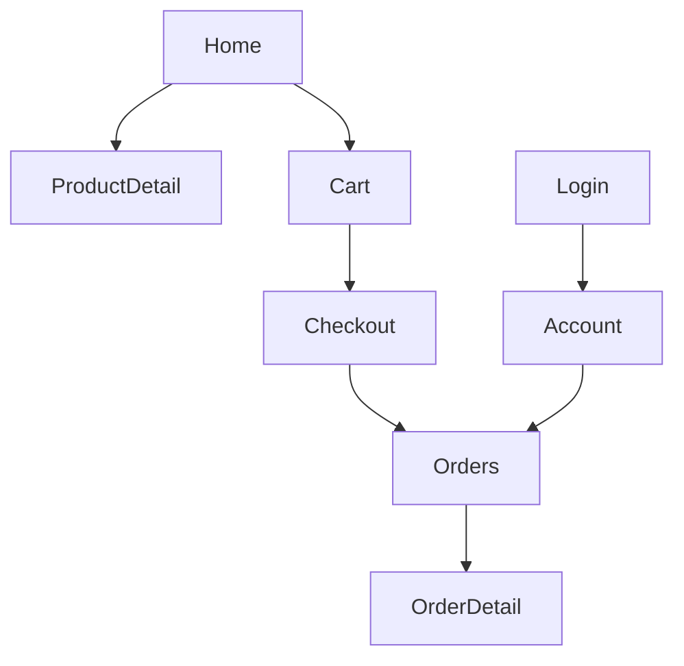
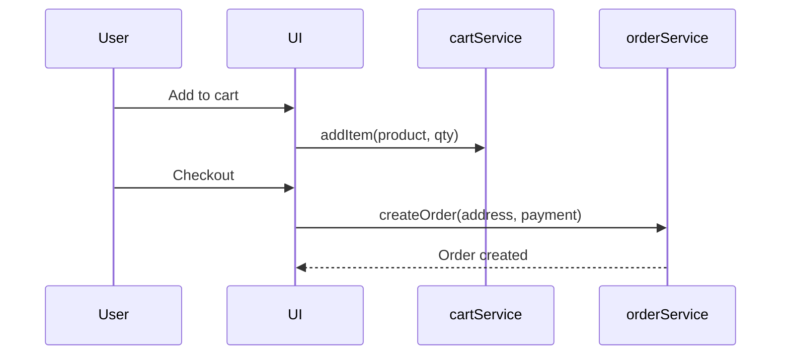
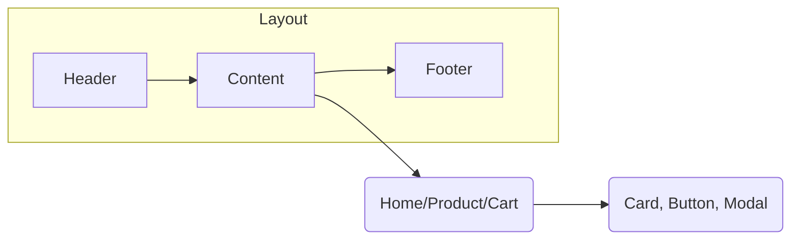
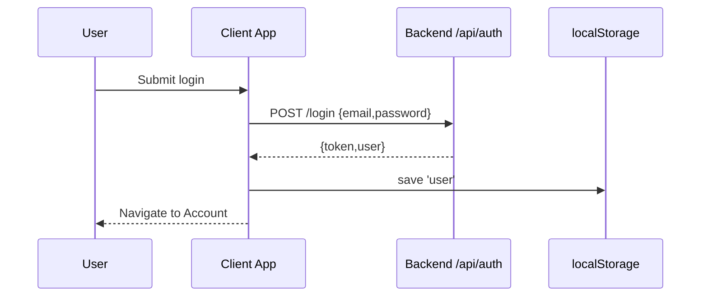

# Aura Shop Frontend Client (Vue 3) — Complete Developer Documentation

## Overview
The customer-facing frontend lives in `metainflu/frontend/client`. It is a Vue 3 + Vite + Tailwind application that consumes the backend REST API to provide product browsing, cart, checkout, order history, and account flows. This document provides file-by-file explanations, diagrams of data and UI flows, code examples, improvement suggestions, and next steps.

## Tech Stack
- Vue 3 (Composition API)
- Vite (dev/build tooling)
- Vue Router 4
- Tailwind CSS 3
- Optional: Chart.js, Capacitor (config present)

## Directory Structure
```
metainflu/frontend/client/
├── index.html                 # Root HTML (mount point)
├── package.json               # Scripts and dependencies
├── postcss.config.js          # PostCSS/Tailwind processing
├── tailwind.config.{js,cjs}   # Tailwind theme
├── vite.config.js             # Vite config
├── capacitor.config.json      # Capacitor meta (optional mobile)
└── src/
    ├── main.js                # App bootstrap
    ├── App.vue                # Root shell
    ├── index.css              # Tailwind base imports
    ├── LOGIN_FLOW.md          # Auth diagram notes
    ├── layouts/               # App/layout shells
    ├── components/            # Reusable UI components
    ├── pages/                 # Route pages (home, product, cart, checkout, etc.)
    ├── router/                # Vue Router setup and routes
    └── services/              # API clients (auth, products, cart, orders, etc.)
```

## App Lifecycle
```mermaid
flowchart LR
  A[index.html] --> B[main.js createApp]
  B --> C[register Router]
  B --> D[import Tailwind styles]
  C --> E[App.vue]
  E --> F[Layouts + Pages via <router-view>]
  F --> G[Services (fetch API)]
```

## index.html
- Provides the `#app` mount div and loads `src/main.js`.
- Add SEO metadata, PWA tags, and theming here.

## src/main.js
```javascript
import { createApp } from 'vue';
import App from './App.vue';
import router from './router';
import './index.css'; // Tailwind base

const app = createApp(App);
app.use(router);
app.mount('#app');
```
- Initializes Vue app, registers router, and mounts.
- If using global state (Pinia) or plugins (i18n), register here.

## src/App.vue
- Root shell that renders the current route via `<router-view/>`.
- Typical structure: header, footer, and content slot.

Example:
```vue
<template>
  <div class="min-h-screen flex flex-col bg-gray-50">
    <Header />
    <main class="flex-1">
      <router-view />
    </main>
    <Footer />
  </div>
</template>
```

## Routing
- src/router: defines SPA routes and optional guards.
- Patterns:
  - Public routes: Home, ProductList, ProductDetail, Login, Register
  - Protected routes: Account, Orders, Checkout (guarded by auth)

Router guard example:
```javascript
router.beforeEach((to, from, next) => {
  const user = JSON.parse(localStorage.getItem('user') || 'null');
  if (to.meta.requiresAuth && !user) return next({ name: 'Login' });
  next();
});
```

Router diagram:


## Services Layer
Centralized HTTP calls. Keep base URL and headers consistent, handle errors and tokens.

### Auth Service (src/services/authService.js)
Key points:
- API base: `http://localhost:5000/api/auth/`
- Methods: `register`, `login`, `logout`
- Stores user JSON (with token) in `localStorage['user']`

Example usage:
```javascript
import auth from '@/services/authService';
const onLogin = async () => {
  const data = await auth.login({ email, password });
  // navigate to account
};
```

### Product Service (src/services/productService.js)
- List products with filters (category)
- Get single product details

Example:
```javascript
export const listProducts = async (params) =>
  fetch(`/api/products?${new URLSearchParams(params)}`).then(r=>r.json());
```

### Cart/Order Services
- cartService: add/remove items, get cart
- orderService: create order, get my orders

Sequence: add to cart → checkout → create order


## Tailwind Styling
- tailwind.config.{js,cjs} extends theme (colors, fonts, radii)
- src/index.css imports Tailwind base, components, utilities

Example index.css:
```css
@tailwind base;
@tailwind components;
@tailwind utilities;
```

## State Management (Optional)
- Consider Pinia for cart, auth, and product state.

Example Pinia store:
```javascript
export const useAuth = defineStore('auth', {
  state:()=>({ user: JSON.parse(localStorage.getItem('user')||'null') }),
  actions:{ setUser(u){ this.user=u; localStorage.setItem('user', JSON.stringify(u)); } }
});
```

## Component/Pages Guidelines
- Components: small, reusable (buttons, inputs, cards)
- Pages: route-level containers (Home, ProductDetail, Cart, Checkout, Account)
- Layouts: wrap pages (default layout with header/footer; auth layout without footer)

UI flow:


## Error Handling & UX
- Show toast on API errors
- Handle 401 by redirecting to Login
- Empty states for lists and order history
- Loading skeletons for product grids

## Performance Best Practices
- Code-split routes with dynamic imports
- Use v-memo and computed for expensive ops
- Prefer pagination/infinite scroll over large lists

Lazy route example:
```javascript
const ProductDetail = () => import('../pages/ProductDetail.vue');
```

## Security Considerations
- Tokens in localStorage are vulnerable to XSS
- Prefer HttpOnly cookies in production (backend change needed)
- Sanitize/escape user inputs in UI where applicable

## Accessibility
- Semantic HTML, aria-* attributes
- Sufficient color contrast from Tailwind theme
- Keyboard navigation and focus states

## Testing
- Unit: Vue Test Utils + Vitest/Jest for components
- E2E: Cypress for core flows (login, browse, add to cart, checkout)

## Improvements & Next Steps
- Add Pinia and centralize auth/cart state
- Move API base URL to Vite env (VITE_API_BASE_URL)
- Add route guards and role-based pages (e.g., special offers)
- Implement skeleton loaders and optimistic UI for cart
- Add PWA (workbox), offline cart, and install prompts
- Add i18n and theme switcher (light/dark)
- Add Sentry for error tracking

## Example: Product List Page
```vue
<script setup>
import { ref, onMounted } from 'vue';
import { listProducts } from '@/services/productService';
const products = ref([]);
const loading = ref(true);
const error = ref('');

onMounted(async ()=>{
  try { products.value = await listProducts({ category: 'All' }); }
  catch(e){ error.value = e.message || 'Failed to load'; }
  finally { loading.value = false; }
});
</script>

<template>
  <div class="p-4">
    <h1 class="text-2xl font-semibold mb-4">Products</h1>
    <div v-if="loading">Loading...</div>
    <div v-else-if="error" class="text-red-600">{{ error }}</div>
    <div v-else class="grid grid-cols-2 md:grid-cols-3 lg:grid-cols-4 gap-4">
      <article v-for="p in products" :key="p._id" class="bg-white rounded-lg shadow p-3">
        
        <h2 class="mt-2 font-medium">{{ p.name }}</h2>
      </article>
    </div>
  </div>
</template>
```

## Example: Auth Flow Diagram (from LOGIN_FLOW.md inspiration)


## Environment Configuration
- Create `.env` with `VITE_API_BASE_URL` and use in services
- Vite exposes `import.meta.env.VITE_*` vars

Service example with env:
```javascript
const BASE = import.meta.env.VITE_API_BASE_URL || 'http://localhost:5000';
export const api = (path, opts)=> fetch(`${BASE}/api${path}`, opts);
```

---
Last updated: Oct 2025
