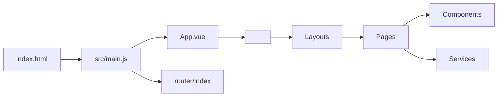
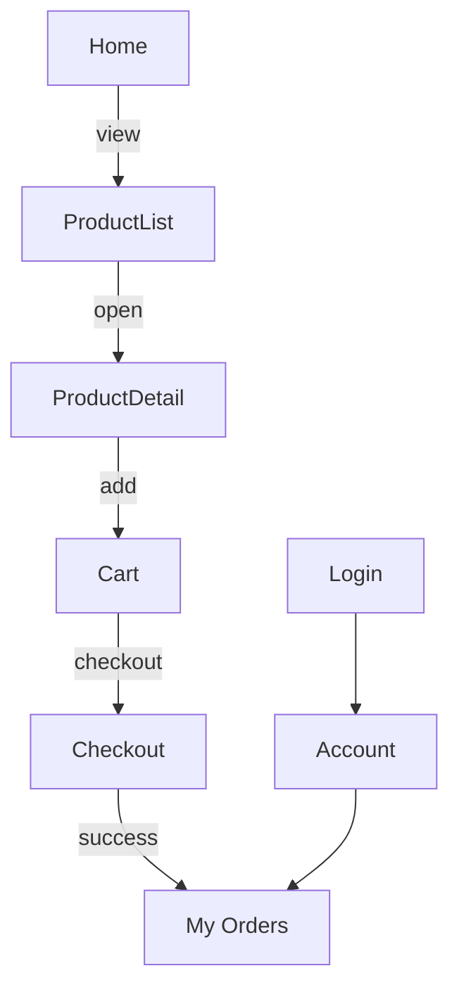
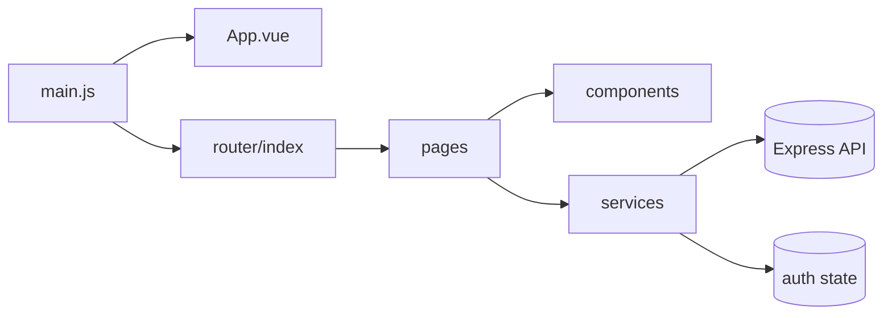
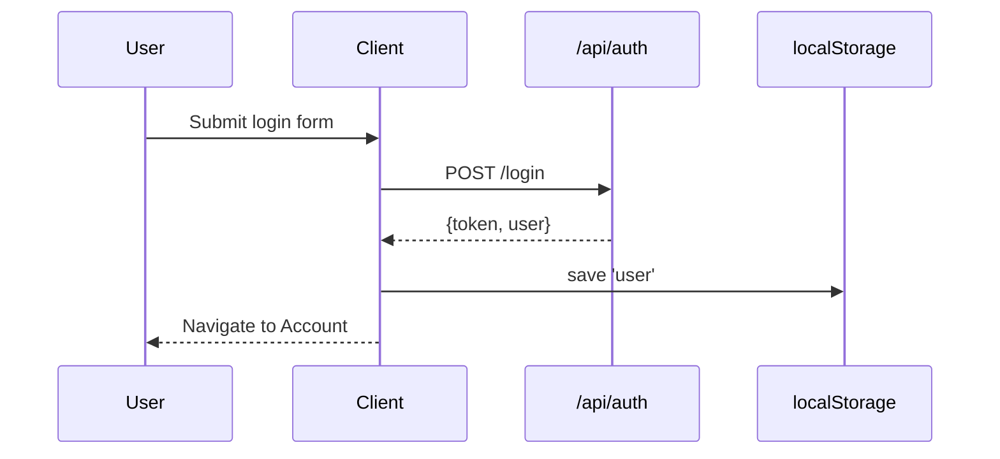
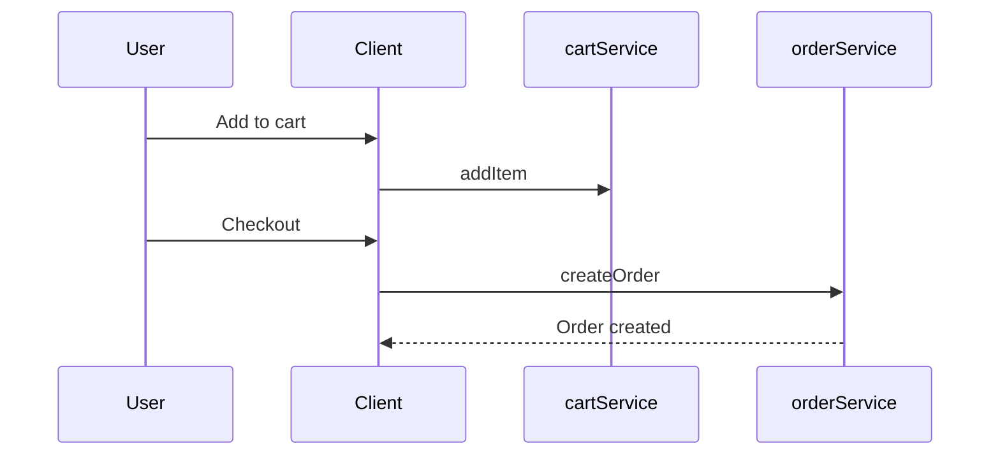

# Frontend Client SRC — Deep Developer Documentation

This document covers every file and directory in metainflu/frontend/client/src: what each does, how they connect, technologies used, visual diagrams, reuse guidance, and improvement ideas. Use this as your day-to-day reference when working on the customer app.

## Tech Overview
- Framework: Vue 3 (Composition API)
- Router: Vue Router 4
- Styling: Tailwind CSS
- Build: Vite
- API access: fetch (plain) in most services

## Directory Map
```
src/
├── App.vue                # Root shell
├── LOGIN_FLOW.md          # Design note for login
├── index.css              # Tailwind base/styles
├── main.js                # App bootstrap
├── components/            # Reusable UI atoms/molecules
├── layouts/               # Page wrappers (header/footer)
├── pages/                 # Route-level pages
├── router/                # SPA routes and guards
└── services/              # API clients (auth, products, cart, orders, vendor)
```

## High-level App Wiring


## File-by-File Details

### main.js
- Creates the Vue app, registers the router, mounts to #app.
- Imports Tailwind via index.css.

Key responsibilities:
- Single place to add global providers (e.g., Pinia, i18n, analytics, error tracking).

Example extension (Pinia):
```js
import { createApp } from 'vue';
import { createPinia } from 'pinia';
import App from './App.vue';
import router from './router';
import './index.css';

const app = createApp(App);
app.use(createPinia());
app.use(router);
app.mount('#app');
```

### App.vue
- Root shell that hosts the current route via <router-view/>.
- Good place for global UI like header/footer, toasts.

Structure example:
```vue
<template>
  <div class="min-h-screen flex flex-col bg-gray-50">
    <AppHeader />
    <main class="flex-1">
      <router-view />
    </main>
    <AppFooter />
  </div>
</template>
```

### index.css
- Tailwind base setup (imports base/components/utilities).
- Add app-wide CSS variables and utilities here.

### LOGIN_FLOW.md
- Reference note explaining the login sequence.
- Keep in sync with actual auth implementation in services/authService.js.

### components/
- Holds small, reusable UI parts: buttons, inputs, cards, badges, modals.
- Aim for stateless/presentational components with props + events.

Recommended patterns:
- Prefix atoms with Ui* (UiButton.vue, UiInput.vue) to distinguish from pages.
- Extract duplicated page markup into components (e.g., ProductCard, ProductGrid, Pagination).

### layouts/
- Wrap pages with common chrome (header/footer/sidebars).
- Keep minimal logic—layouts are containers for page content.

Common layouts:
- DefaultLayout.vue (header/footer)
- AuthLayout.vue (focused auth pages)

### pages/
- Route-level views. Each page orchestrates state fetching from services and renders components.
- Examples (typical for a shop): Home.vue, ProductList.vue, ProductDetail.vue, Cart.vue, Checkout.vue, Orders.vue, Account.vue, Login.vue, Register.vue.

Page lifecycle pattern:
```vue
<script setup>
import { ref, onMounted } from 'vue';
import { listProducts } from '@/services/productService';

const products = ref([]);
const loading = ref(true);
const error = ref('');

onMounted(async () => {
  try {
    products.value = await listProducts({ category: 'All' });
  } catch (e) {
    error.value = e.message || 'Failed to load';
  } finally {
    loading.value = false;
  }
});
</script>
```

### router/
- Declares routes and optional guards (e.g., requiresAuth).
- Single source of truth for navigation.

Typical routes:
- Public: '/', '/products/:id', '/login', '/register'
- Protected: '/account', '/orders', '/checkout'

Guard wiring:
```js
router.beforeEach((to, from, next) => {
  const user = JSON.parse(localStorage.getItem('user') || 'null');
  if (to.meta.requiresAuth && !user) return next({ name: 'Login' });
  next();
});
```

Route overview:


### services/
- API clients. Encapsulate fetch/headers/URL building.
- Files present:
  - authService.js — register/login/logout; stores user in localStorage
  - productService.js — list/get products
  - cartService.js — cart actions
  - orderService.js — order actions
  - categoryService.js — fetch categories
  - vendorService.js — vendor endpoints from storefront (if any)
  - influencerService.js — legacy/optional
  - sequenceDiagram.md — documentation note

Service layering diagram:
```mermaid
flowchart LR
  Pages --> Services --> API[/Backend /api]
  Services --> LocalStorage[(localStorage)]
```

Auth storage contract:
- Key: 'user'
- Shape: `{ _id, name, email, role, token }`

Example service base (environment-driven):
```js
const BASE = import.meta.env.VITE_API_BASE_URL || 'http://localhost:5000';
const api = (p, o) => fetch(`${BASE}/api${p}`, o);
```

## How Files Connect


## Important Files to Know
- main.js — app initialization point
- router/index.js — navigation map and guards
- services/authService.js — login/register/logout and auth storage
- services/productService.js — core browsing data
- App.vue — global shell entry to UI

## Reuse Guidance
- Extract repeated UI into components (product tiles, price badges, loaders, empty states).
- Centralize API calls in services; never fetch in components directly.
- Share composables (create src/composables/) for common logic (useAuth, useCart, useFetch).

Example composable:
```js
// src/composables/useAuth.js
import { computed } from 'vue';
export const useAuth = () => {
  const getUser = () => JSON.parse(localStorage.getItem('user')||'null');
  const isLoggedIn = computed(() => !!getUser());
  return { isLoggedIn, getUser };
};
```

## Visual Data & UI Flows

### Auth Flow


### Cart → Order Flow


## Technologies In Use
- Vue 3 SFCs with <script setup>
- Tailwind utility classes for layout/spacing/typography
- Vite dev server (port 5173)
- LocalStorage for auth state

## Improvements
- Move API base to .env (VITE_API_BASE_URL) everywhere in services.
- Add Pinia for auth/cart/product state (remove direct localStorage reads from router guards; use store getters).
- Add axios with interceptors for token header and unified error handling.
- Add route-level code splitting for heavy pages.
- Implement skeleton loaders and optimistic cart updates.
- Add i18n and theme toggling; centralize theme tokens.
- Add Sentry (error tracking) and route timing metrics.

## Developer Recipes

### Add a new protected page (e.g., Wishlist)
1) Create src/pages/Wishlist.vue
2) Add route:
```js
{ path: '/wishlist', name: 'Wishlist', component: () => import('../pages/Wishlist.vue'), meta: { requiresAuth: true } }
```
3) Use auth store in page to ensure logged in.

### Use axios with Authorization header
```js
// src/services/http.js
import axios from 'axios';
const http = axios.create({ baseURL: (import.meta.env.VITE_API_BASE_URL||'http://localhost:5000') + '/api' });
http.interceptors.request.use(cfg => {
  const u = JSON.parse(localStorage.getItem('user')||'null');
  if (u?.token) cfg.headers.Authorization = `Bearer ${u.token}`;
  return cfg;
});
export default http;
```

### Handle 401 globally
- In axios response interceptor: if 401, clear user and redirect to /login.

## Testing Suggestions
- Unit test composables and components (Vue Test Utils + Vitest)
- Integration test services with MSW (mock service worker)
- E2E: Cypress flows (login → browse → cart → checkout)

## Maintenance Checklist
- Keep routes and pages in sync
- Centralize API endpoints in services
- Avoid duplicating UI patterns—create components
- Document new flows in /src/LOGIN_FLOW.md and project docs

---
Last updated: Oct 2025
