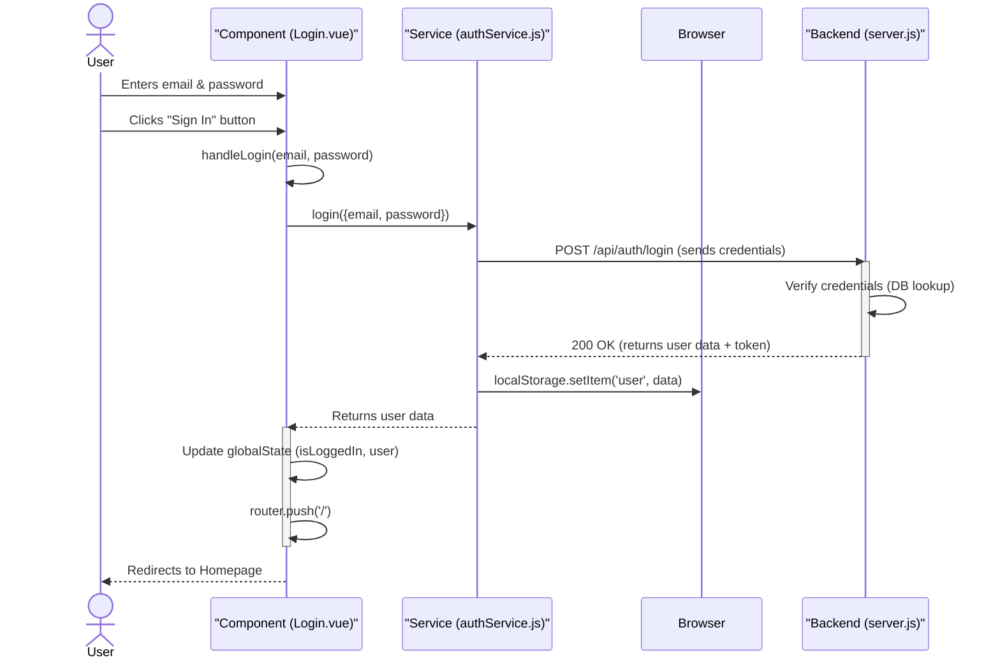

# Login Data Flow Analysis

This document breaks down the entire login process for the client-side application, detailing the data flow from user interaction to final state update.

### Login Process: Step-by-Step Explanation

Here is what happens from the moment a user clicks the "Sign In" button to when they are successfully logged in and redirected.

1.  **User Enters Credentials**:
    *   The user visits the login page, which is rendered by the `Login.vue` component.
    *   They type their email and password into the input fields. These values are bound to the `email` and `password` data properties of the `Login.vue` component via `v-model`.

2.  **Form Submission**:
    *   The user clicks the "Sign In" button.
    *   This triggers the `handleLogin` method within `Login.vue` because the form has the `@submit.prevent="handleLogin"` event listener.

3.  **Calling the Authentication Service**:
    *   Inside `handleLogin`, the `email` and `password` are packaged into a `userData` object.
    *   This `userData` object is passed to the `login` function from the imported `authService`.
    *   `await authService.login(userData);` is called.

4.  **Making the API Request**:
    *   The `authService.login` function executes.
    *   It uses the browser's `fetch` API to send an HTTP **POST** request to the backend server at `http://localhost:5000/api/auth/login`.
    *   The `userData` (email and password) is converted to a JSON string and sent in the body of the request.

5.  **Backend Authentication**:
    *   The backend server (at `localhost:5000`) receives the request.
    *   It verifies the user's credentials, typically by looking up the user by email and comparing the provided password hash with the one stored in the database.
    *   If the credentials are valid, the backend generates a session token (likely a JWT) and sends back a success response (e.g., HTTP 200 OK) with a JSON body containing the user's data and the token. If invalid, it sends an error (e.g., HTTP 401 Unauthorized).

6.  **Handling the API Response**:
    *   The `fetch` promise in `authService.login` resolves.
    *   The service checks if the response was successful (`response.ok`).
    *   If successful, it parses the JSON data from the response body.
    *   **Crucially, it stores the received user data and token in the browser's `localStorage`** by calling `localStorage.setItem('user', JSON.stringify(data))`. This is what keeps the user logged in even if they refresh the page.
    *   The service then returns the user data to the `handleLogin` method in `Login.vue`.

7.  **Updating Application State**:
    *   Control returns to `Login.vue`'s `handleLogin` method.
    *   It updates the `globalState` object (which is imported from `main.js` and is a Vue `reactive` object).
        *   `globalState.isLoggedIn` is set to `true`.
        *   `globalState.user` is set to the user data received from the backend.
    *   Because `globalState` is reactive, any other component in the application that depends on `isLoggedIn` or `user` (like a navigation bar showing "Logout" instead of "Login") will automatically update.

8.  **Redirecting the User**:
    *   Finally, `handleLogin` calls `this.router.push('/')` to navigate the user from the login page to the application's homepage.

### Data Flow Diagram (Sequence Diagram)

This diagram visualizes the sequence of interactions between the different parts of your application during the login process.

