# Shop Page Documentation

## Overview

This document provides comprehensive technical documentation for the Shop Page module, including its architecture, data flow, interactions with other system components, and implementation details for developers.

### Purpose

The Shop Page serves as the primary interface for users to browse, search, filter, and purchase products from the e-commerce platform. It integrates with multiple backend services to provide a seamless shopping experience.

### Key Features

- **Product Listing**: Display products with pagination and lazy loading
- **Search & Filter**: Real-time search with advanced filtering options
- **Sorting**: Multiple sorting criteria (price, popularity, newest, ratings)
- **Product Details**: Quick view and detailed product pages
- **Cart Integration**: Add to cart functionality with real-time updates
- **Wishlist Management**: Save products for later
- **Responsive Design**: Mobile-first approach with adaptive layouts

---

## System Architecture

### High-Level Architecture

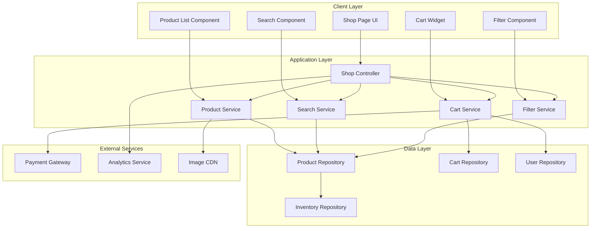
```mermaid
graph TB
    subgraph "Client Layer"
        A[Shop Page UI]
        B[Product List Component]
        C[Filter Component]
        D[Search Component]
        E[Cart Widget]
    end
    
    subgraph "Application Layer"
        F[Shop Controller]
        G[Product Service]
        H[Cart Service]
        I[Search Service]
        J[Filter Service]
    end
    
    subgraph "Data Layer"
        K[Product Repository]
        L[Cart Repository]
        M[User Repository]
        N[Inventory Repository]
    end
    
    subgraph "External Services"
        O[Payment Gateway]
        P[Analytics Service]
        Q[Image CDN]
    end
    
    A --> F
    B --> G
    C --> J
    D --> I
    E --> H
    
    F --> G
    F --> H
    F --> I
    F --> J
    
    G --> K
    H --> L
    I --> K
    J --> K
    
    K --> N
    H --> M
    
    G --> Q
    F --> P
    H --> O
```

---

## Data Flow Diagrams

### Level 0 DFD (Context Diagram)

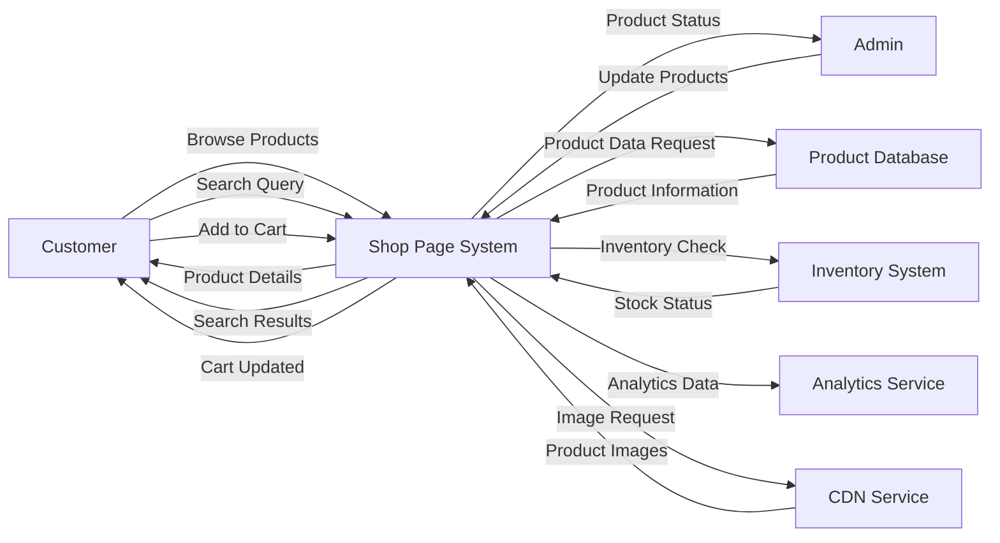
```mermaid
graph LR
    A[Customer] -->|Browse Products| B[Shop Page System]
    B -->|Product Details| A
    A -->|Search Query| B
    B -->|Search Results| A
    A -->|Add to Cart| B
    B -->|Cart Updated| A
    
    C[Admin] -->|Update Products| B
    B -->|Product Status| C
    
    B -->|Product Data Request| D[Product Database]
    D -->|Product Information| B
    
    B -->|Inventory Check| E[Inventory System]
    E -->|Stock Status| B
    
    B -->|Analytics Data| F[Analytics Service]
    
    B -->|Image Request| G[CDN Service]
    G -->|Product Images| B
```

### Level 1 DFD (Major Processes)

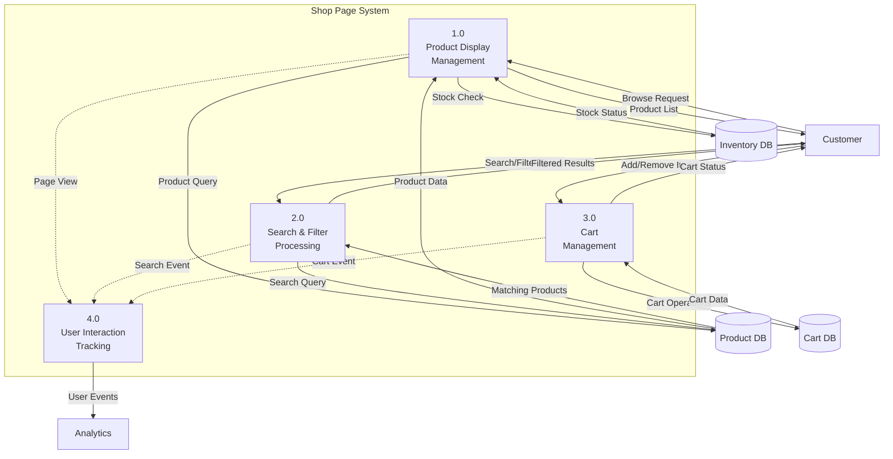
```mermaid
graph TB
    subgraph "Shop Page System"
        P1[1.0<br/>Product Display<br/>Management]
        P2[2.0<br/>Search & Filter<br/>Processing]
        P3[3.0<br/>Cart<br/>Management]
        P4[4.0<br/>User Interaction<br/>Tracking]
    end
    
    Customer[Customer] -->|Browse Request| P1
    P1 -->|Product List| Customer
    
    Customer -->|Search/Filter Query| P2
    P2 -->|Filtered Results| Customer
    
    Customer -->|Add/Remove Items| P3
    P3 -->|Cart Status| Customer
    
    P1 -->|Product Query| DB1[(Product DB)]
    DB1 -->|Product Data| P1
    
    P2 -->|Search Query| DB1
    DB1 -->|Matching Products| P2
    
    P3 -->|Cart Operations| DB2[(Cart DB)]
    DB2 -->|Cart Data| P3
    
    P1 -->|Stock Check| DB3[(Inventory DB)]
    DB3 -->|Stock Status| P1
    
    P4 -->|User Events| Analytics[Analytics]
    P1 -.->|Page View| P4
    P2 -.->|Search Event| P4
    P3 -.->|Cart Event| P4
```

### Level 2 DFD (Search & Filter Process Detail)

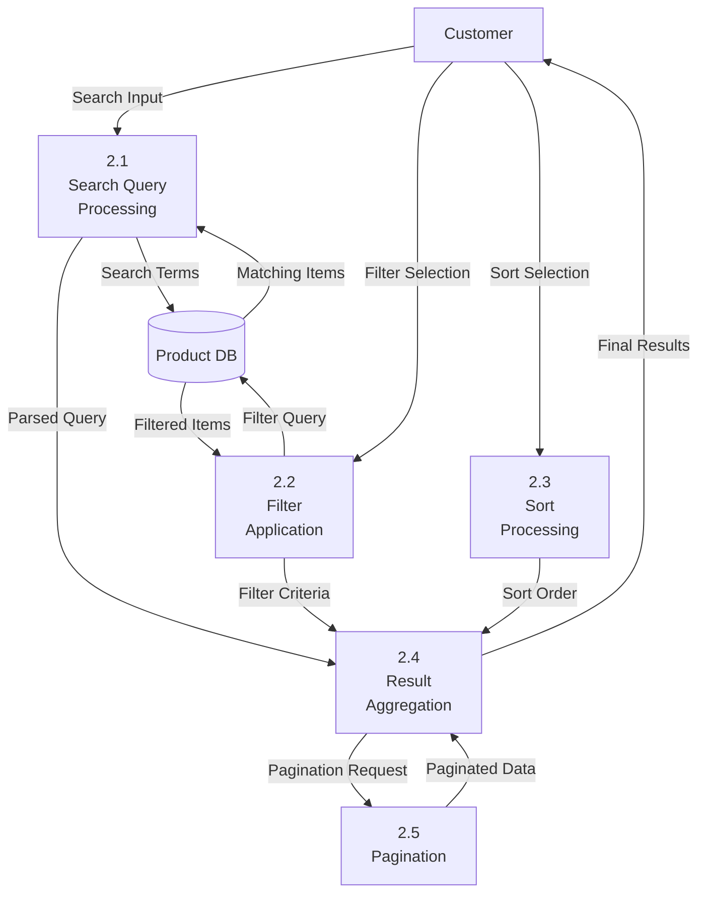
```mermaid
graph TB
    Customer[Customer] -->|Search Input| P21[2.1<br/>Search Query<br/>Processing]
    Customer -->|Filter Selection| P22[2.2<br/>Filter<br/>Application]
    Customer -->|Sort Selection| P23[2.3<br/>Sort<br/>Processing]
    
    P21 -->|Parsed Query| P24[2.4<br/>Result<br/>Aggregation]
    P22 -->|Filter Criteria| P24
    P23 -->|Sort Order| P24
    
    P24 -->|Final Results| Customer
    
    P21 -->|Search Terms| DB1[(Product DB)]
    DB1 -->|Matching Items| P21
    
    P22 -->|Filter Query| DB1
    DB1 -->|Filtered Items| P22
    
    P24 -->|Pagination Request| P25[2.5<br/>Pagination]
    P25 -->|Paginated Data| P24
```

---

## Sequence Diagrams

### Product Browsing Flow

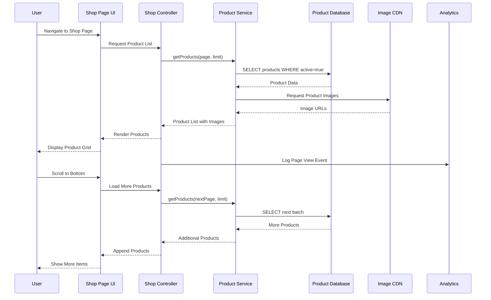
```mermaid
sequenceDiagram
    participant U as User
    participant UI as Shop Page UI
    participant C as Shop Controller
    participant PS as Product Service
    participant DB as Product Database
    participant CDN as Image CDN
    participant A as Analytics
    
    U->>UI: Navigate to Shop Page
    UI->>C: Request Product List
    C->>PS: getProducts(page, limit)
    PS->>DB: SELECT products WHERE active=true
    DB-->>PS: Product Data
    PS->>CDN: Request Product Images
    CDN-->>PS: Image URLs
    PS-->>C: Product List with Images
    C-->>UI: Render Products
    UI-->>U: Display Product Grid
    
    C->>A: Log Page View Event
    
    U->>UI: Scroll to Bottom
    UI->>C: Load More Products
    C->>PS: getProducts(nextPage, limit)
    PS->>DB: SELECT next batch
    DB-->>PS: More Products
    PS-->>C: Additional Products
    C-->>UI: Append Products
    UI-->>U: Show More Items
```

### Search and Filter Flow

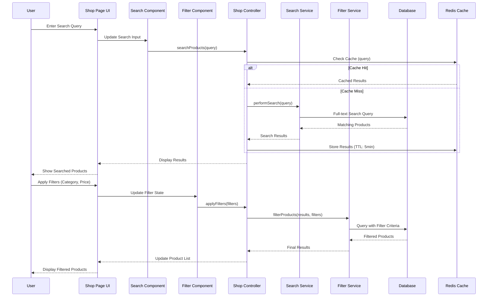
```mermaid
sequenceDiagram
    participant U as User
    participant UI as Shop Page UI
    participant SC as Search Component
    participant FC as Filter Component
    participant C as Shop Controller
    participant SS as Search Service
    participant FS as Filter Service
    participant DB as Database
    participant Cache as Redis Cache
    
    U->>UI: Enter Search Query
    UI->>SC: Update Search Input
    SC->>C: searchProducts(query)
    C->>Cache: Check Cache (query)
    
    alt Cache Hit
        Cache-->>C: Cached Results
    else Cache Miss
        C->>SS: performSearch(query)
        SS->>DB: Full-text Search Query
        DB-->>SS: Matching Products
        SS-->>C: Search Results
        C->>Cache: Store Results (TTL: 5min)
    end
    
    C-->>UI: Display Results
    UI-->>U: Show Searched Products
    
    U->>UI: Apply Filters (Category, Price)
    UI->>FC: Update Filter State
    FC->>C: applyFilters(filters)
    C->>FS: filterProducts(results, filters)
    FS->>DB: Query with Filter Criteria
    DB-->>FS: Filtered Products
    FS-->>C: Final Results
    C-->>UI: Update Product List
    UI-->>U: Display Filtered Products
```

### Add to Cart Flow

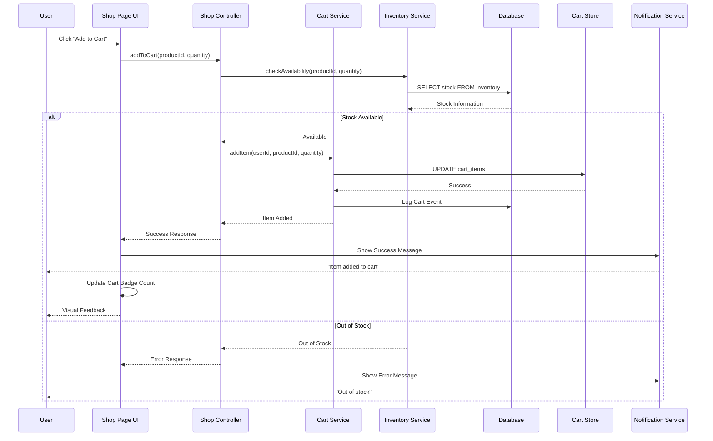
```mermaid
sequenceDiagram
    participant U as User
    participant UI as Shop Page UI
    participant C as Shop Controller
    participant CS as Cart Service
    participant IS as Inventory Service
    participant DB as Database
    participant Cart as Cart Store
    participant Notif as Notification Service
    
    U->>UI: Click "Add to Cart"
    UI->>C: addToCart(productId, quantity)
    C->>IS: checkAvailability(productId, quantity)
    IS->>DB: SELECT stock FROM inventory
    DB-->>IS: Stock Information
    
    alt Stock Available
        IS-->>C: Available
        C->>CS: addItem(userId, productId, quantity)
        CS->>Cart: UPDATE cart_items
        Cart-->>CS: Success
        CS->>DB: Log Cart Event
        CS-->>C: Item Added
        C-->>UI: Success Response
        UI->>Notif: Show Success Message
        Notif-->>U: "Item added to cart"
        UI->>UI: Update Cart Badge Count
        UI-->>U: Visual Feedback
    else Out of Stock
        IS-->>C: Out of Stock
        C-->>UI: Error Response
        UI->>Notif: Show Error Message
        Notif-->>U: "Out of stock"
    end
```

### Checkout Initiation Flow

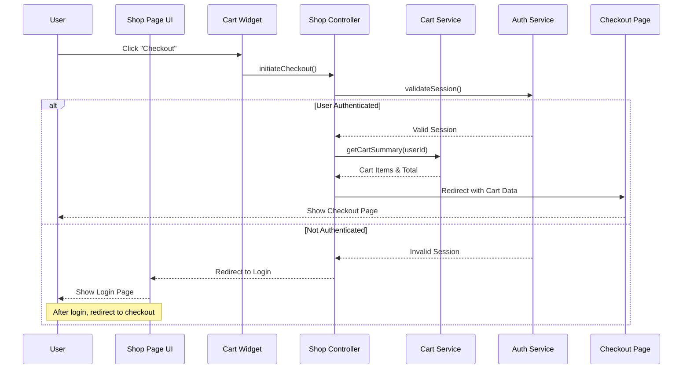
```mermaid
sequenceDiagram
    participant U as User
    participant UI as Shop Page UI
    participant Cart as Cart Widget
    participant C as Shop Controller
    participant CS as Cart Service
    participant Auth as Auth Service
    participant CO as Checkout Page
    
    U->>Cart: Click "Checkout"
    Cart->>C: initiateCheckout()
    C->>Auth: validateSession()
    
    alt User Authenticated
        Auth-->>C: Valid Session
        C->>CS: getCartSummary(userId)
        CS-->>C: Cart Items & Total
        C->>CO: Redirect with Cart Data
        CO-->>U: Show Checkout Page
    else Not Authenticated
        Auth-->>C: Invalid Session
        C-->>UI: Redirect to Login
        UI-->>U: Show Login Page
        Note over U,UI: After login, redirect to checkout
    end
```

---

## Component Diagrams

### Shop Page Component Structure

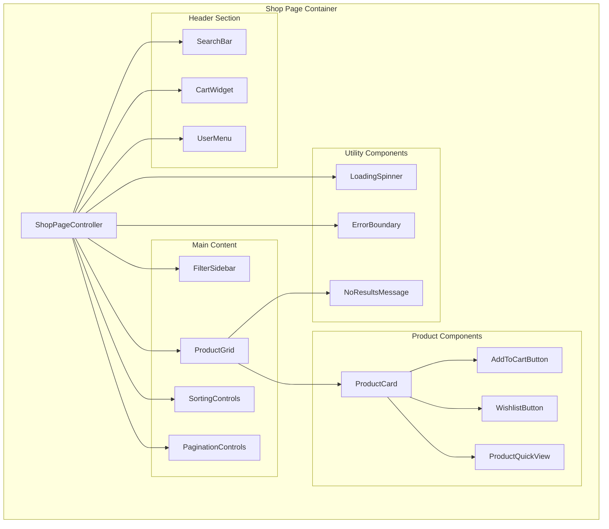
```mermaid
graph TB
    subgraph "Shop Page Container"
        A[ShopPageController]
        
        subgraph "Header Section"
            B[SearchBar]
            C[CartWidget]
            D[UserMenu]
        end
        
        subgraph "Main Content"
            E[FilterSidebar]
            F[ProductGrid]
            G[SortingControls]
            H[PaginationControls]
        end
        
        subgraph "Product Components"
            I[ProductCard]
            J[ProductQuickView]
            K[AddToCartButton]
            L[WishlistButton]
        end
        
        subgraph "Utility Components"
            M[LoadingSpinner]
            N[ErrorBoundary]
            O[NoResultsMessage]
        end
    end
    
    A --> B
    A --> C
    A --> D
    A --> E
    A --> F
    A --> G
    A --> H
    
    F --> I
    I --> K
    I --> L
    I --> J
    
    A --> M
    A --> N
    F --> O
```

### Service Layer Architecture

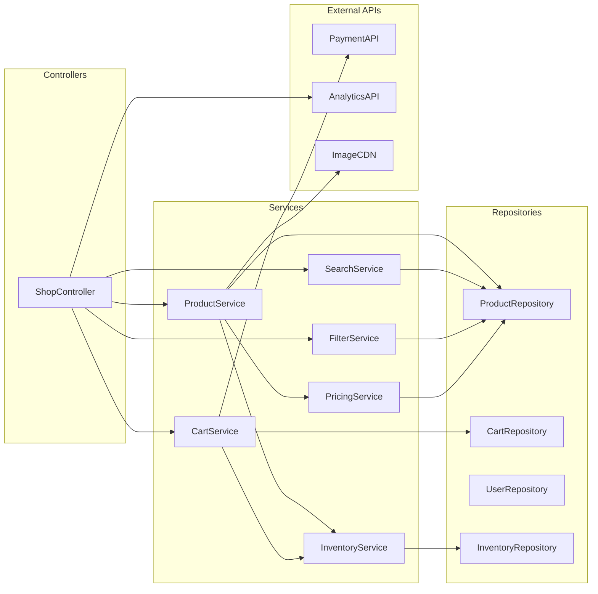
```mermaid
graph LR
    subgraph "Controllers"
        A[ShopController]
    end
    
    subgraph "Services"
        B[ProductService]
        C[CartService]
        D[SearchService]
        E[FilterService]
        F[InventoryService]
        G[PricingService]
    end
    
    subgraph "Repositories"
        H[ProductRepository]
        I[CartRepository]
        J[UserRepository]
        K[InventoryRepository]
    end
    
    subgraph "External APIs"
        L[PaymentAPI]
        M[AnalyticsAPI]
        N[ImageCDN]
    end
    
    A --> B
    A --> C
    A --> D
    A --> E
    
    B --> H
    B --> F
    B --> G
    C --> I
    C --> F
    D --> H
    E --> H
    F --> K
    G --> H
    
    B --> N
    A --> M
    C --> L
```

---

## State Diagrams

### Shop Page State Management

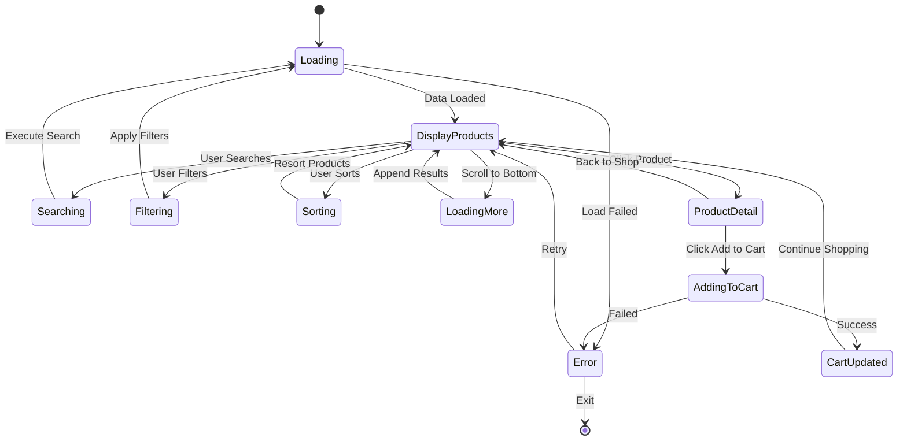
```mermaid
stateDiagram-v2
    [*] --> Loading
    Loading --> DisplayProducts: Data Loaded
    Loading --> Error: Load Failed
    
    DisplayProducts --> Searching: User Searches
    DisplayProducts --> Filtering: User Filters
    DisplayProducts --> Sorting: User Sorts
    DisplayProducts --> LoadingMore: Scroll to Bottom
    DisplayProducts --> ProductDetail: Click Product
    
    Searching --> Loading: Execute Search
    Filtering --> Loading: Apply Filters
    Sorting --> DisplayProducts: Resort Products
    LoadingMore --> DisplayProducts: Append Results
    
    ProductDetail --> DisplayProducts: Back to Shop
    ProductDetail --> AddingToCart: Click Add to Cart
    
    AddingToCart --> CartUpdated: Success
    AddingToCart --> Error: Failed
    
    CartUpdated --> DisplayProducts: Continue Shopping
    
    Error --> DisplayProducts: Retry
    Error --> [*]: Exit
```

### Product Card State

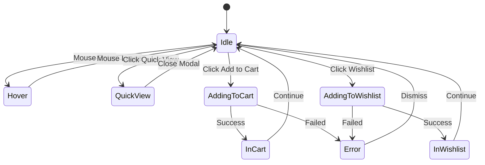
```mermaid
stateDiagram-v2
    [*] --> Idle
    Idle --> Hover: Mouse Enter
    Hover --> Idle: Mouse Leave
    
    Idle --> QuickView: Click Quick View
    QuickView --> Idle: Close Modal
    
    Idle --> AddingToCart: Click Add to Cart
    AddingToCart --> InCart: Success
    AddingToCart --> Error: Failed
    
    InCart --> Idle: Continue
    Error --> Idle: Dismiss
    
    Idle --> AddingToWishlist: Click Wishlist
    AddingToWishlist --> InWishlist: Success
    AddingToWishlist --> Error: Failed
    
    InWishlist --> Idle: Continue
```

---

## Entity Relationship Diagram

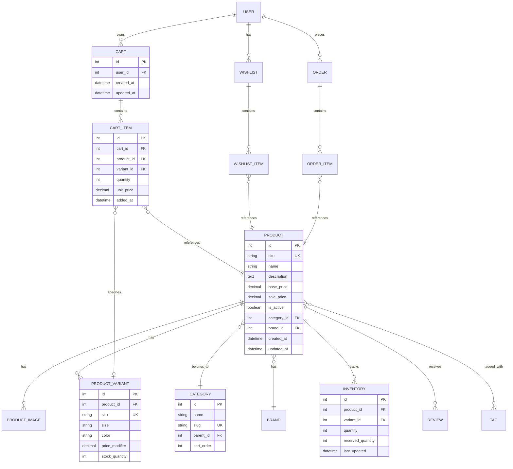
```mermaid
erDiagram
    PRODUCT ||--o{ PRODUCT_IMAGE : has
    PRODUCT ||--o{ PRODUCT_VARIANT : has
    PRODUCT }o--|| CATEGORY : belongs_to
    PRODUCT }o--|| BRAND : has
    PRODUCT ||--o{ INVENTORY : tracks
    PRODUCT ||--o{ REVIEW : receives
    PRODUCT }o--o{ TAG : tagged_with
    
    USER ||--o{ CART : owns
    CART ||--o{ CART_ITEM : contains
    CART_ITEM }o--|| PRODUCT : references
    CART_ITEM }o--o| PRODUCT_VARIANT : specifies
    
    USER ||--o{ WISHLIST : has
    WISHLIST ||--o{ WISHLIST_ITEM : contains
    WISHLIST_ITEM }o--|| PRODUCT : references
    
    USER ||--o{ ORDER : places
    ORDER ||--o{ ORDER_ITEM : contains
    ORDER_ITEM }o--|| PRODUCT : references
    
    PRODUCT {
        int id PK
        string sku UK
        string name
        text description
        decimal base_price
        decimal sale_price
        boolean is_active
        int category_id FK
        int brand_id FK
        datetime created_at
        datetime updated_at
    }
    
    CATEGORY {
        int id PK
        string name
        string slug UK
        int parent_id FK
        int sort_order
    }
    
    PRODUCT_VARIANT {
        int id PK
        int product_id FK
        string sku UK
        string size
        string color
        decimal price_modifier
        int stock_quantity
    }
    
    CART {
        int id PK
        int user_id FK
        datetime created_at
        datetime updated_at
    }
    
    CART_ITEM {
        int id PK
        int cart_id FK
        int product_id FK
        int variant_id FK
        int quantity
        decimal unit_price
        datetime added_at
    }
    
    INVENTORY {
        int id PK
        int product_id FK
        int variant_id FK
        int quantity
        int reserved_quantity
        datetime last_updated
    }
```

---

## API Endpoints

### Product Endpoints

#### GET /api/shop/products

**Description**: Retrieve paginated list of products with optional filters

**Query Parameters**:
- `page` (integer): Page number (default: 1)
- `limit` (integer): Items per page (default: 20, max: 100)
- `category` (string): Category slug or ID
- `search` (string): Search query
- `minPrice` (decimal): Minimum price filter
- `maxPrice` (decimal): Maximum price filter
- `sort` (string): Sort order (newest, price_asc, price_desc, popular, rating)
- `inStock` (boolean): Only show in-stock items

**Response**:
```json
{
  "success": true,
  "data": {
    "products": [
      {
        "id": 123,
        "sku": "PROD-001",
        "name": "Product Name",
        "description": "Product description",
        "price": 99.99,
        "salePrice": 79.99,
        "currency": "USD",
        "images": [
          {
            "url": "https://cdn.example.com/image1.jpg",
            "alt": "Product image",
            "isPrimary": true
          }
        ],
        "category": {
          "id": 5,
          "name": "Electronics",
          "slug": "electronics"
        },
        "brand": {
          "id": 10,
          "name": "Brand Name"
        },
        "rating": 4.5,
        "reviewCount": 128,
        "inStock": true,
        "stockQuantity": 50,
        "tags": ["featured", "sale"]
      }
    ],
    "pagination": {
      "currentPage": 1,
      "totalPages": 10,
      "totalItems": 200,
      "itemsPerPage": 20,
      "hasNext": true,
      "hasPrevious": false
    }
  }
}
```

#### GET /api/shop/products/{id}

**Description**: Get detailed information for a specific product

**Path Parameters**:
- `id` (integer): Product ID

**Response**:
```json
{
  "success": true,
  "data": {
    "id": 123,
    "sku": "PROD-001",
    "name": "Product Name",
    "description": "Detailed product description",
    "longDescription": "Extended description with HTML",
    "price": 99.99,
    "salePrice": 79.99,
    "currency": "USD",
    "images": [...],
    "variants": [
      {
        "id": 1,
        "sku": "PROD-001-S-RED",
        "size": "S",
        "color": "Red",
        "priceModifier": 0,
        "stockQuantity": 10
      }
    ],
    "specifications": {
      "weight": "500g",
      "dimensions": "10x10x5 cm"
    },
    "reviews": [...],
    "relatedProducts": [...]
  }
}
```

### Cart Endpoints

#### POST /api/shop/cart/items

**Description**: Add item to cart

**Request Body**:
```json
{
  "productId": 123,
  "variantId": 1,
  "quantity": 2
}
```

**Response**:
```json
{
  "success": true,
  "message": "Item added to cart",
  "data": {
    "cartId": 456,
    "itemCount": 3,
    "subtotal": 259.97
  }
}
```

#### GET /api/shop/cart

**Description**: Get current user's cart

**Response**:
```json
{
  "success": true,
  "data": {
    "id": 456,
    "items": [
      {
        "id": 789,
        "product": {...},
        "variant": {...},
        "quantity": 2,
        "unitPrice": 79.99,
        "subtotal": 159.98
      }
    ],
    "subtotal": 259.97,
    "tax": 20.80,
    "shipping": 10.00,
    "total": 290.77,
    "currency": "USD"
  }
}
```

### Search & Filter Endpoints

#### GET /api/shop/search

**Description**: Search products with autocomplete support

**Query Parameters**:
- `q` (string): Search query (required)
- `limit` (integer): Max results (default: 10)

**Response**:
```json
{
  "success": true,
  "data": {
    "query": "laptop",
    "suggestions": [
      {
        "type": "product",
        "id": 123,
        "name": "Gaming Laptop",
        "price": 999.99,
        "image": "..."
      },
      {
        "type": "category",
        "name": "Laptops",
        "slug": "laptops"
      }
    ],
    "count": 45
  }
}
```

#### GET /api/shop/filters

**Description**: Get available filter options for current product set

**Query Parameters**:
- `category` (string): Category context

**Response**:
```json
{
  "success": true,
  "data": {
    "categories": [
      {"id": 1, "name": "Electronics", "count": 150}
    ],
    "brands": [
      {"id": 5, "name": "Brand A", "count": 45}
    ],
    "priceRange": {
      "min": 10.00,
      "max": 5000.00
    },
    "attributes": {
      "color": ["Red", "Blue", "Green"],
      "size": ["S", "M", "L", "XL"]
    }
  }
}
```

---

## Database Schema

### Products Table

```sql
CREATE TABLE products (
    id INT PRIMARY KEY AUTO_INCREMENT,
    sku VARCHAR(50) UNIQUE NOT NULL,
    name VARCHAR(255) NOT NULL,
    slug VARCHAR(255) UNIQUE NOT NULL,
    description TEXT,
    long_description TEXT,
    base_price DECIMAL(10, 2) NOT NULL,
    sale_price DECIMAL(10, 2),
    currency VARCHAR(3) DEFAULT 'USD',
    category_id INT NOT NULL,
    brand_id INT,
    is_active BOOLEAN DEFAULT true,
    is_featured BOOLEAN DEFAULT false,
    meta_title VARCHAR(255),
    meta_description TEXT,
    created_at TIMESTAMP DEFAULT CURRENT_TIMESTAMP,
    updated_at TIMESTAMP DEFAULT CURRENT_TIMESTAMP ON UPDATE CURRENT_TIMESTAMP,
    FOREIGN KEY (category_id) REFERENCES categories(id),
    FOREIGN KEY (brand_id) REFERENCES brands(id),
    INDEX idx_category (category_id),
    INDEX idx_active (is_active),
    INDEX idx_featured (is_featured),
    FULLTEXT INDEX idx_search (name, description)
);
```

### Cart Tables

```sql
CREATE TABLE carts (
    id INT PRIMARY KEY AUTO_INCREMENT,
    user_id INT NOT NULL,
    session_id VARCHAR(255),
    created_at TIMESTAMP DEFAULT CURRENT_TIMESTAMP,
    updated_at TIMESTAMP DEFAULT CURRENT_TIMESTAMP ON UPDATE CURRENT_TIMESTAMP,
    FOREIGN KEY (user_id) REFERENCES users(id),
    INDEX idx_user (user_id),
    INDEX idx_session (session_id)
);

CREATE TABLE cart_items (
    id INT PRIMARY KEY AUTO_INCREMENT,
    cart_id INT NOT NULL,
    product_id INT NOT NULL,
    variant_id INT,
    quantity INT NOT NULL DEFAULT 1,
    unit_price DECIMAL(10, 2) NOT NULL,
    added_at TIMESTAMP DEFAULT CURRENT_TIMESTAMP,
    FOREIGN KEY (cart_id) REFERENCES carts(id) ON DELETE CASCADE,
    FOREIGN KEY (product_id) REFERENCES products(id),
    FOREIGN KEY (variant_id) REFERENCES product_variants(id),
    UNIQUE KEY unique_cart_item (cart_id, product_id, variant_id)
);
```

### Inventory Table

```sql
CREATE TABLE inventory (
    id INT PRIMARY KEY AUTO_INCREMENT,
    product_id INT NOT NULL,
    variant_id INT,
    quantity INT NOT NULL DEFAULT 0,
    reserved_quantity INT NOT NULL DEFAULT 0,
    available_quantity INT GENERATED ALWAYS AS (quantity - reserved_quantity) STORED,
    low_stock_threshold INT DEFAULT 10,
    last_updated TIMESTAMP DEFAULT CURRENT_TIMESTAMP ON UPDATE CURRENT_TIMESTAMP,
    FOREIGN KEY (product_id) REFERENCES products(id),
    FOREIGN KEY (variant_id) REFERENCES product_variants(id),
    UNIQUE KEY unique_inventory (product_id, variant_id),
    INDEX idx_availability (available_quantity)
);
```

---

## Frontend Implementation

### Technology Stack

- **Framework**: React 18+ / Vue 3+ / Angular 15+
- **State Management**: Redux / Vuex / NgRx
- **HTTP Client**: Axios / Fetch API
- **UI Library**: Material-UI / Tailwind CSS / Bootstrap
- **Build Tool**: Vite / Webpack
- **Testing**: Jest + React Testing Library

### Component Implementation Example

#### Shop Page Container (React)

```javascript
// ShopPage.jsx
import React, { useEffect, useState } from 'react';
import { useDispatch, useSelector } from 'react-redux';
import { fetchProducts, applyFilters, updateSort } from './shopSlice';
import ProductGrid from './components/ProductGrid';
import FilterSidebar from './components/FilterSidebar';
import SearchBar from './components/SearchBar';
import Pagination from './components/Pagination';

const ShopPage = () => {
  const dispatch = useDispatch();
  const { products, loading, error, pagination, filters } = useSelector(
    (state) => state.shop
  );

  const [currentPage, setCurrentPage] = useState(1);

  useEffect(() => {
    dispatch(fetchProducts({ page: currentPage, filters }));
  }, [dispatch, currentPage, filters]);

  const handleFilterChange = (newFilters) => {
    dispatch(applyFilters(newFilters));
    setCurrentPage(1); // Reset to first page
  };

  const handlePageChange = (page) => {
    setCurrentPage(page);
    window.scrollTo({ top: 0, behavior: 'smooth' });
  };

  if (loading) return <LoadingSpinner />;
  if (error) return <ErrorMessage message={error} />;

  return (
    <div className="shop-page">
      <SearchBar />
      
      <div className="shop-content">
        <FilterSidebar 
          filters={filters}
          onFilterChange={handleFilterChange}
        />
        
        <div className="products-section">
          <SortControls />
          <ProductGrid products={products} />
          <Pagination 
            currentPage={currentPage}
            totalPages={pagination.totalPages}
            onPageChange={handlePageChange}
          />
        </div>
      </div>
    </div>
  );
};

export default ShopPage;
```

#### Redux Slice (State Management)

```javascript
// shopSlice.js
import { createSlice, createAsyncThunk } from '@reduxjs/toolkit';
import { shopAPI } from '../services/api';

export const fetchProducts = createAsyncThunk(
  'shop/fetchProducts',
  async ({ page = 1, filters = {} }) => {
    const response = await shopAPI.getProducts(page, filters);
    return response.data;
  }
);

export const addToCart = createAsyncThunk(
  'shop/addToCart',
  async ({ productId, quantity, variantId }) => {
    const response = await shopAPI.addToCart(productId, quantity, variantId);
    return response.data;
  }
);

const shopSlice = createSlice({
  name: 'shop',
  initialState: {
    products: [],
    loading: false,
    error: null,
    filters: {
      category: null,
      minPrice: null,
      maxPrice: null,
      search: '',
      sort: 'newest'
    },
    pagination: {
      currentPage: 1,
      totalPages: 1,
      totalItems: 0
    },
    cart: {
      items: [],
      total: 0
    }
  },
  reducers: {
    applyFilters: (state, action) => {
      state.filters = { ...state.filters, ...action.payload };
    },
    updateSort: (state, action) => {
      state.filters.sort = action.payload;
    },
    clearFilters: (state) => {
      state.filters = {
        category: null,
        minPrice: null,
        maxPrice: null,
        search: '',
        sort: 'newest'
      };
    }
  },
  extraReducers: (builder) => {
    builder
      .addCase(fetchProducts.pending, (state) => {
        state.loading = true;
        state.error = null;
      })
      .addCase(fetchProducts.fulfilled, (state, action) => {
        state.loading = false;
        state.products = action.payload.products;
        state.pagination = action.payload.pagination;
      })
      .addCase(fetchProducts.rejected, (state, action) => {
        state.loading = false;
        state.error = action.error.message;
      })
      .addCase(addToCart.fulfilled, (state, action) => {
        state.cart = action.payload;
      });
  }
});

export const { applyFilters, updateSort, clearFilters } = shopSlice.actions;
export default shopSlice.reducer;
```

### API Service Layer

```javascript
// services/api.js
import axios from 'axios';

const API_BASE_URL = process.env.REACT_APP_API_URL || 'http://localhost:3000/api';

const apiClient = axios.create({
  baseURL: API_BASE_URL,
  headers: {
    'Content-Type': 'application/json'
  },
  timeout: 10000
});

// Request interceptor for adding auth token
apiClient.interceptors.request.use(
  (config) => {
    const token = localStorage.getItem('authToken');
    if (token) {
      config.headers.Authorization = `Bearer ${token}`;
    }
    return config;
  },
  (error) => Promise.reject(error)
);

// Response interceptor for error handling
apiClient.interceptors.response.use(
  (response) => response,
  (error) => {
    if (error.response?.status === 401) {
      // Handle unauthorized access
      localStorage.removeItem('authToken');
      window.location.href = '/login';
    }
    return Promise.reject(error);
  }
);

export const shopAPI = {
  getProducts: (page = 1, filters = {}) => {
    const params = new URLSearchParams({
      page,
      limit: 20,
      ...filters
    });
    return apiClient.get(`/shop/products?${params}`);
  },

  getProductById: (id) => {
    return apiClient.get(`/shop/products/${id}`);
  },

  searchProducts: (query, limit = 10) => {
    return apiClient.get(`/shop/search?q=${encodeURIComponent(query)}&limit=${limit}`);
  },

  getFilters: (category = null) => {
    const params = category ? `?category=${category}` : '';
    return apiClient.get(`/shop/filters${params}`);
  },

  addToCart: (productId, quantity, variantId = null) => {
    return apiClient.post('/shop/cart/items', {
      productId,
      quantity,
      variantId
    });
  },

  getCart: () => {
    return apiClient.get('/shop/cart');
  },

  updateCartItem: (itemId, quantity) => {
    return apiClient.put(`/shop/cart/items/${itemId}`, { quantity });
  },

  removeFromCart: (itemId) => {
    return apiClient.delete(`/shop/cart/items/${itemId}`);
  }
};
```

---

## Backend Implementation

### Technology Stack

- **Runtime**: Node.js 18+ / Python 3.10+ / Java 17+
- **Framework**: Express.js / FastAPI / Spring Boot
- **Database**: PostgreSQL / MySQL / MongoDB
- **ORM**: Sequelize / SQLAlchemy / Hibernate
- **Cache**: Redis
- **Search**: Elasticsearch (optional)

### Controller Implementation (Node.js/Express)

```javascript
// controllers/shopController.js
const ProductService = require('../services/productService');
const CartService = require('../services/cartService');
const { validationResult } = require('express-validator');

class ShopController {
  /**
   * Get paginated list of products
   * @route GET /api/shop/products
   */
  async getProducts(req, res) {
    try {
      const {
        page = 1,
        limit = 20,
        category,
        search,
        minPrice,
        maxPrice,
        sort = 'newest',
        inStock
      } = req.query;

      const filters = {
        category,
        search,
        minPrice: minPrice ? parseFloat(minPrice) : null,
        maxPrice: maxPrice ? parseFloat(maxPrice) : null,
        inStock: inStock === 'true',
        sort
      };

      const result = await ProductService.getProducts(
        parseInt(page),
        parseInt(limit),
        filters
      );

      res.json({
        success: true,
        data: result
      });
    } catch (error) {
      console.error('Error fetching products:', error);
      res.status(500).json({
        success: false,
        error: 'Failed to fetch products'
      });
    }
  }

  /**
   * Get single product details
   * @route GET /api/shop/products/:id
   */
  async getProductById(req, res) {
    try {
      const { id } = req.params;
      const product = await ProductService.getProductById(id);

      if (!product) {
        return res.status(404).json({
          success: false,
          error: 'Product not found'
        });
      }

      res.json({
        success: true,
        data: product
      });
    } catch (error) {
      console.error('Error fetching product:', error);
      res.status(500).json({
        success: false,
        error: 'Failed to fetch product'
      });
    }
  }

  /**
   * Add item to cart
   * @route POST /api/shop/cart/items
   */
  async addToCart(req, res) {
    try {
      const errors = validationResult(req);
      if (!errors.isEmpty()) {
        return res.status(400).json({
          success: false,
          errors: errors.array()
        });
      }

      const userId = req.user.id; // From auth middleware
      const { productId, variantId, quantity } = req.body;

      // Check product availability
      const available = await ProductService.checkAvailability(
        productId,
        variantId,
        quantity
      );

      if (!available) {
        return res.status(400).json({
          success: false,
          error: 'Product is out of stock or insufficient quantity'
        });
      }

      const cartData = await CartService.addItem(
        userId,
        productId,
        quantity,
        variantId
      );

      res.json({
        success: true,
        message: 'Item added to cart',
        data: cartData
      });
    } catch (error) {
      console.error('Error adding to cart:', error);
      res.status(500).json({
        success: false,
        error: 'Failed to add item to cart'
      });
    }
  }

  /**
   * Get user's cart
   * @route GET /api/shop/cart
   */
  async getCart(req, res) {
    try {
      const userId = req.user.id;
      const cart = await CartService.getCart(userId);

      res.json({
        success: true,
        data: cart
      });
    } catch (error) {
      console.error('Error fetching cart:', error);
      res.status(500).json({
        success: false,
        error: 'Failed to fetch cart'
      });
    }
  }
}

module.exports = new ShopController();
```

### Service Layer Implementation

```javascript
// services/productService.js
const { Product, Category, Brand, Inventory, Review } = require('../models');
const { Op } = require('sequelize');
const redis = require('../config/redis');

class ProductService {
  /**
   * Get products with filters and pagination
   */
  async getProducts(page, limit, filters) {
    const offset = (page - 1) * limit;
    
    // Build query conditions
    const where = { isActive: true };
    
    if (filters.category) {
      where.categoryId = filters.category;
    }
    
    if (filters.minPrice || filters.maxPrice) {
      where.basePrice = {};
      if (filters.minPrice) where.basePrice[Op.gte] = filters.minPrice;
      if (filters.maxPrice) where.basePrice[Op.lte] = filters.maxPrice;
    }
    
    if (filters.search) {
      where[Op.or] = [
        { name: { [Op.like]: `%${filters.search}%` } },
        { description: { [Op.like]: `%${filters.search}%` } }
      ];
    }
    
    // Determine sort order
    let order = [['createdAt', 'DESC']];
    switch (filters.sort) {
      case 'price_asc':
        order = [['basePrice', 'ASC']];
        break;
      case 'price_desc':
        order = [['basePrice', 'DESC']];
        break;
      case 'popular':
        order = [['viewCount', 'DESC']];
        break;
      case 'rating':
        order = [[{ model: Review, as: 'reviews' }, 'rating', 'DESC']];
        break;
    }
    
    // Execute query
    const { count, rows: products } = await Product.findAndCountAll({
      where,
      include: [
        { model: Category, as: 'category' },
        { model: Brand, as: 'brand' },
        { model: Inventory, as: 'inventory' }
      ],
      order,
      limit,
      offset
    });
    
    // Filter by stock if requested
    let filteredProducts = products;
    if (filters.inStock) {
      filteredProducts = products.filter(p => 
        p.inventory && p.inventory.availableQuantity > 0
      );
    }
    
    return {
      products: filteredProducts.map(p => this.formatProduct(p)),
      pagination: {
        currentPage: page,
        totalPages: Math.ceil(count / limit),
        totalItems: count,
        itemsPerPage: limit,
        hasNext: page * limit < count,
        hasPrevious: page > 1
      }
    };
  }

  /**
   * Get product by ID with caching
   */
  async getProductById(id) {
    // Check cache first
    const cacheKey = `product:${id}`;
    const cached = await redis.get(cacheKey);
    
    if (cached) {
      return JSON.parse(cached);
    }
    
    // Fetch from database
    const product = await Product.findByPk(id, {
      include: [
        { model: Category, as: 'category' },
        { model: Brand, as: 'brand' },
        { model: Inventory, as: 'inventory' },
        { model: Review, as: 'reviews', limit: 10 }
      ]
    });
    
    if (!product) return null;
    
    const formattedProduct = this.formatProduct(product, true);
    
    // Cache for 5 minutes
    await redis.setex(cacheKey, 300, JSON.stringify(formattedProduct));
    
    return formattedProduct;
  }

  /**
   * Check product availability
   */
  async checkAvailability(productId, variantId, quantity) {
    const inventory = await Inventory.findOne({
      where: {
        productId,
        ...(variantId && { variantId })
      }
    });
    
    if (!inventory) return false;
    
    return inventory.availableQuantity >= quantity;
  }

  /**
   * Format product for API response
   */
  formatProduct(product, detailed = false) {
    const formatted = {
      id: product.id,
      sku: product.sku,
      name: product.name,
      description: product.description,
      price: product.basePrice,
      salePrice: product.salePrice,
      currency: product.currency,
      images: product.images || [],
      category: product.category,
      brand: product.brand,
      inStock: product.inventory?.availableQuantity > 0,
      stockQuantity: product.inventory?.availableQuantity || 0
    };
    
    if (detailed) {
      formatted.longDescription = product.longDescription;
      formatted.specifications = product.specifications;
      formatted.reviews = product.reviews;
      formatted.variants = product.variants;
    }
    
    return formatted;
  }
}

module.exports = new ProductService();
```

---

## Performance Optimization

### Caching Strategy

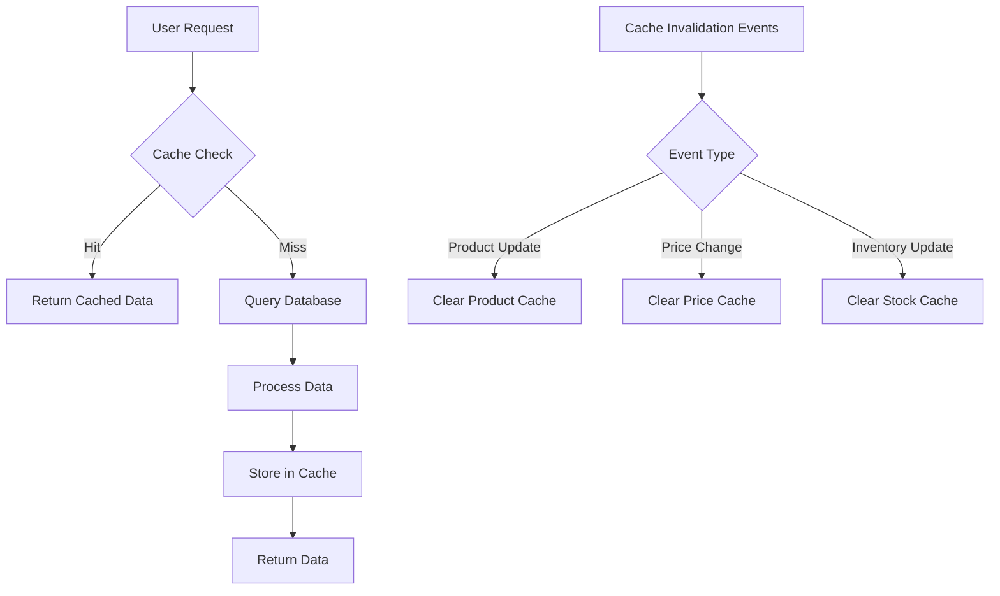
```mermaid
graph TB
    A[User Request] --> B{Cache Check}
    B -->|Hit| C[Return Cached Data]
    B -->|Miss| D[Query Database]
    D --> E[Process Data]
    E --> F[Store in Cache]
    F --> G[Return Data]
    
    H[Cache Invalidation Events] --> I{Event Type}
    I -->|Product Update| J[Clear Product Cache]
    I -->|Price Change| K[Clear Price Cache]
    I -->|Inventory Update| L[Clear Stock Cache]
```

### Optimization Techniques

1. **Database Optimization**
   - Use indexes on frequently queried columns
   - Implement database query caching
   - Use connection pooling
   - Optimize JOIN operations

2. **API Response Optimization**
   - Implement response compression (gzip)
   - Use HTTP/2 for multiplexing
   - Implement API response caching with ETags
   - Paginate large result sets

3. **Frontend Optimization**
   - Lazy load images with intersection observer
   - Implement virtual scrolling for large lists
   - Use code splitting for route-based chunks
   - Implement service workers for offline support
   - Debounce search input

4. **CDN Integration**
   - Serve static assets from CDN
   - Use image optimization services
   - Implement adaptive image loading
   - Cache API responses at edge locations

5. **Database Query Optimization**
   ```sql
   -- Use indexes
   CREATE INDEX idx_products_category_active ON products(category_id, is_active);
   CREATE INDEX idx_products_price ON products(base_price);
   
   -- Optimize search queries
   CREATE FULLTEXT INDEX idx_product_search ON products(name, description);
   
   -- Use query hints for complex queries
   SELECT /*+ USE_INDEX(products, idx_products_category_active) */
     p.*, c.name as category_name
   FROM products p
   INNER JOIN categories c ON p.category_id = c.id
   WHERE p.is_active = 1 AND p.category_id = 5;
   ```

---

## Security Considerations

### Authentication & Authorization

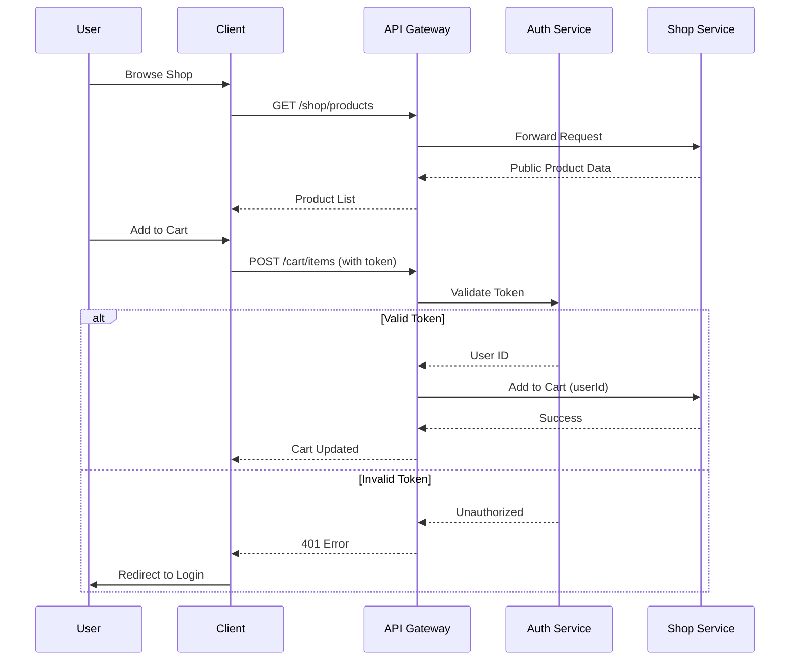
```mermaid
sequenceDiagram
    participant U as User
    participant C as Client
    participant API as API Gateway
    participant Auth as Auth Service
    participant Shop as Shop Service
    
    U->>C: Browse Shop
    C->>API: GET /shop/products
    API->>Shop: Forward Request
    Shop-->>API: Public Product Data
    API-->>C: Product List
    
    U->>C: Add to Cart
    C->>API: POST /cart/items (with token)
    API->>Auth: Validate Token
    
    alt Valid Token
        Auth-->>API: User ID
        API->>Shop: Add to Cart (userId)
        Shop-->>API: Success
        API-->>C: Cart Updated
    else Invalid Token
        Auth-->>API: Unauthorized
        API-->>C: 401 Error
        C->>U: Redirect to Login
    end
```

### Security Best Practices

1. **Input Validation**
   - Validate all user inputs on both client and server
   - Sanitize search queries to prevent injection attacks
   - Use parameterized queries for database operations

2. **Authentication**
   - Implement JWT-based authentication
   - Use secure HTTP-only cookies for session tokens
   - Implement refresh token rotation

3. **Authorization**
   - Verify user permissions for cart operations
   - Implement rate limiting on API endpoints
   - Protect admin-only operations

4. **Data Protection**
   - Encrypt sensitive data at rest
   - Use HTTPS for all communications
   - Implement CSRF protection
   - Set appropriate CORS policies

5. **API Security**
   ```javascript
   // Rate limiting middleware
   const rateLimit = require('express-rate-limit');
   
   const apiLimiter = rateLimit({
     windowMs: 15 * 60 * 1000, // 15 minutes
     max: 100, // limit each IP to 100 requests per windowMs
     message: 'Too many requests from this IP'
   });
   
   app.use('/api/', apiLimiter);
   ```

---

## Testing Strategy

### Test Pyramid

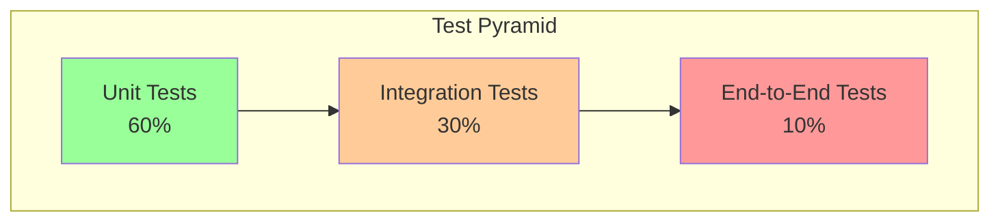
```mermaid
graph TB
    subgraph "Test Pyramid"
        A[End-to-End Tests<br/>10%]
        B[Integration Tests<br/>30%]
        C[Unit Tests<br/>60%]
    end
    
    C --> B
    B --> A
    
    style A fill:#ff9999
    style B fill:#ffcc99
    style C fill:#99ff99
```

### Unit Testing Example

```javascript
// __tests__/services/productService.test.js
const ProductService = require('../services/productService');
const { Product, Category } = require('../models');

jest.mock('../models');

describe('ProductService', () => {
  describe('getProducts', () => {
    it('should return paginated products', async () => {
      const mockProducts = [
        { id: 1, name: 'Product 1', basePrice: 99.99 },
        { id: 2, name: 'Product 2', basePrice: 149.99 }
      ];
      
      Product.findAndCountAll.mockResolvedValue({
        count: 2,
        rows: mockProducts
      });
      
      const result = await ProductService.getProducts(1, 20, {});
      
      expect(result.products).toHaveLength(2);
      expect(result.pagination.currentPage).toBe(1);
      expect(result.pagination.totalItems).toBe(2);
    });
    
    it('should filter by category', async () => {
      const filters = { category: 5 };
      
      await ProductService.getProducts(1, 20, filters);
      
      expect(Product.findAndCountAll).toHaveBeenCalledWith(
        expect.objectContaining({
          where: expect.objectContaining({ categoryId: 5 })
        })
      );
    });
  });
  
  describe('checkAvailability', () => {
    it('should return true when stock is available', async () => {
      const mockInventory = { availableQuantity: 10 };
      Inventory.findOne.mockResolvedValue(mockInventory);
      
      const result = await ProductService.checkAvailability(1, null, 5);
      
      expect(result).toBe(true);
    });
    
    it('should return false when stock is insufficient', async () => {
      const mockInventory = { availableQuantity: 3 };
      Inventory.findOne.mockResolvedValue(mockInventory);
      
      const result = await ProductService.checkAvailability(1, null, 5);
      
      expect(result).toBe(false);
    });
  });
});
```

### Integration Testing

```javascript
// __tests__/integration/shop.test.js
const request = require('supertest');
const app = require('../app');
const { sequelize } = require('../models');

describe('Shop API Integration Tests', () => {
  beforeAll(async () => {
    await sequelize.sync({ force: true });
    // Seed test data
  });
  
  afterAll(async () => {
    await sequelize.close();
  });
  
  describe('GET /api/shop/products', () => {
    it('should return product list', async () => {
      const response = await request(app)
        .get('/api/shop/products')
        .expect(200);
      
      expect(response.body.success).toBe(true);
      expect(response.body.data.products).toBeDefined();
      expect(response.body.data.pagination).toBeDefined();
    });
    
    it('should filter products by price range', async () => {
      const response = await request(app)
        .get('/api/shop/products?minPrice=50&maxPrice=100')
        .expect(200);
      
      const products = response.body.data.products;
      products.forEach(product => {
        expect(product.price).toBeGreaterThanOrEqual(50);
        expect(product.price).toBeLessThanOrEqual(100);
      });
    });
  });
  
  describe('POST /api/shop/cart/items', () => {
    it('should add item to cart when authenticated', async () => {
      const token = 'valid-jwt-token'; // Generate valid token
      
      const response = await request(app)
        .post('/api/shop/cart/items')
        .set('Authorization', `Bearer ${token}`)
        .send({
          productId: 1,
          quantity: 2
        })
        .expect(200);
      
      expect(response.body.success).toBe(true);
      expect(response.body.data.itemCount).toBeGreaterThan(0);
    });
    
    it('should return 401 when not authenticated', async () => {
      await request(app)
        .post('/api/shop/cart/items')
        .send({
          productId: 1,
          quantity: 2
        })
        .expect(401);
    });
  });
});
```

---

## Deployment & DevOps

### Deployment Architecture

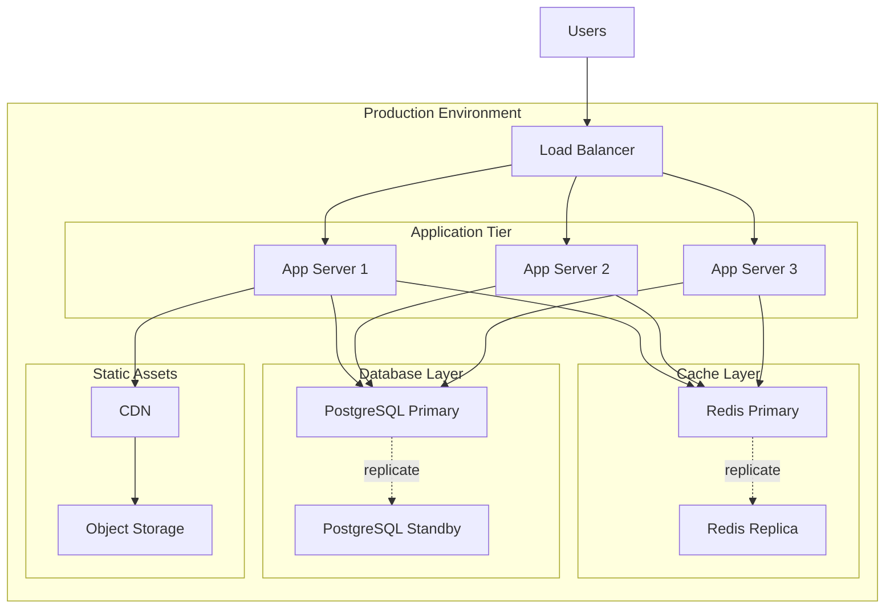
```mermaid
graph TB
    subgraph "Production Environment"
        LB[Load Balancer]
        
        subgraph "Application Tier"
            APP1[App Server 1]
            APP2[App Server 2]
            APP3[App Server 3]
        end
        
        subgraph "Cache Layer"
            REDIS1[Redis Primary]
            REDIS2[Redis Replica]
        end
        
        subgraph "Database Layer"
            DB1[PostgreSQL Primary]
            DB2[PostgreSQL Standby]
        end
        
        subgraph "Static Assets"
            CDN[CDN]
            S3[Object Storage]
        end
    end
    
    Users[Users] --> LB
    LB --> APP1
    LB --> APP2
    LB --> APP3
    
    APP1 --> REDIS1
    APP2 --> REDIS1
    APP3 --> REDIS1
    REDIS1 -.replicate.-> REDIS2
    
    APP1 --> DB1
    APP2 --> DB1
    APP3 --> DB1
    DB1 -.replicate.-> DB2
    
    APP1 --> CDN
    CDN --> S3
```

### CI/CD Pipeline

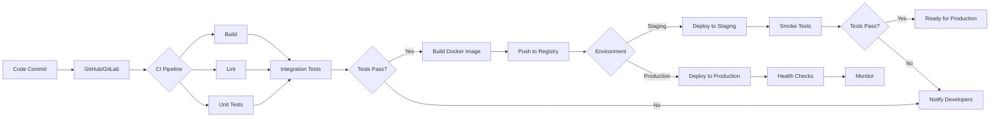
```mermaid
graph LR
    A[Code Commit] --> B[GitHub/GitLab]
    B --> C{CI Pipeline}
    C --> D[Build]
    C --> E[Lint]
    C --> F[Unit Tests]
    
    D --> G[Integration Tests]
    E --> G
    F --> G
    
    G --> H{Tests Pass?}
    H -->|Yes| I[Build Docker Image]
    H -->|No| J[Notify Developers]
    
    I --> K[Push to Registry]
    K --> L{Environment}
    
    L -->|Staging| M[Deploy to Staging]
    L -->|Production| N[Deploy to Production]
    
    M --> O[Smoke Tests]
    O --> P{Tests Pass?}
    P -->|Yes| Q[Ready for Production]
    P -->|No| J
    
    N --> R[Health Checks]
    R --> S[Monitor]
```

### Environment Variables

```bash
# .env.example
NODE_ENV=production
PORT=3000

# Database
DB_HOST=localhost
DB_PORT=5432
DB_NAME=shop_db
DB_USER=shop_user
DB_PASSWORD=secure_password

# Redis
REDIS_HOST=localhost
REDIS_PORT=6379
REDIS_PASSWORD=redis_password

# JWT
JWT_SECRET=your_jwt_secret_key
JWT_EXPIRY=1h
REFRESH_TOKEN_EXPIRY=7d

# API
API_BASE_URL=https://api.example.com
API_RATE_LIMIT=100

# CDN
CDN_URL=https://cdn.example.com
IMAGE_STORAGE_BUCKET=product-images

# Payment
PAYMENT_GATEWAY_KEY=pg_key
PAYMENT_GATEWAY_SECRET=pg_secret

# Analytics
ANALYTICS_ID=UA-XXXXX-X
```

---

## Monitoring & Logging

### Monitoring Dashboard

Key metrics to track:
- **Performance Metrics**: Response time, throughput, error rate
- **Business Metrics**: Products viewed, add-to-cart rate, conversion rate
- **Infrastructure Metrics**: CPU usage, memory usage, database connections
- **User Metrics**: Active users, session duration, bounce rate

### Logging Strategy

```javascript
// logger.js
const winston = require('winston');

const logger = winston.createLogger({
  level: process.env.LOG_LEVEL || 'info',
  format: winston.format.combine(
    winston.format.timestamp(),
    winston.format.errors({ stack: true }),
    winston.format.json()
  ),
  defaultMeta: { service: 'shop-service' },
  transports: [
    new winston.transports.File({ filename: 'error.log', level: 'error' }),
    new winston.transports.File({ filename: 'combined.log' })
  ]
});

if (process.env.NODE_ENV !== 'production') {
  logger.add(new winston.transports.Console({
    format: winston.format.simple()
  }));
}

module.exports = logger;
```

### Error Tracking

```javascript
// middleware/errorHandler.js
const logger = require('../logger');

const errorHandler = (err, req, res, next) => {
  logger.error({
    message: err.message,
    stack: err.stack,
    url: req.url,
    method: req.method,
    ip: req.ip,
    userId: req.user?.id
  });
  
  const statusCode = err.statusCode || 500;
  const message = process.env.NODE_ENV === 'production' 
    ? 'Internal server error' 
    : err.message;
  
  res.status(statusCode).json({
    success: false,
    error: message,
    ...(process.env.NODE_ENV !== 'production' && { stack: err.stack })
  });
};

module.exports = errorHandler;
```

---

## Troubleshooting Guide

### Common Issues

#### Issue 1: Slow Product Loading

**Symptoms**: Products take more than 3 seconds to load

**Possible Causes**:
- Database query inefficiency
- Missing indexes
- Large image sizes
- Network latency

**Solutions**:
1. Check database query execution plan
2. Add indexes on frequently queried columns
3. Implement image optimization and lazy loading
4. Enable database query caching
5. Use CDN for static assets

#### Issue 2: Cart Items Not Updating

**Symptoms**: Added items don't appear in cart

**Possible Causes**:
- Session expired
- Authentication token invalid
- Database connection issues
- Race condition in concurrent requests

**Solutions**:
1. Verify JWT token validity
2. Check database connection pool
3. Implement optimistic locking
4. Add retry logic for failed requests

#### Issue 3: Search Returns No Results

**Symptoms**: Search functionality returns empty results for valid queries

**Possible Causes**:
- Special characters in search query
- Full-text search index not built
- Search query too specific

**Solutions**:
1. Sanitize and normalize search input
2. Rebuild full-text search indexes
3. Implement fuzzy matching
4. Add search suggestions

---

## Future Enhancements

### Planned Features

1. **Advanced Personalization**
   - AI-powered product recommendations
   - Personalized search results
   - Dynamic pricing based on user behavior

2. **Enhanced Search**
   - Natural language search
   - Visual search (image-based)
   - Voice search integration

3. **Social Features**
   - User reviews and ratings
   - Product Q&A
   - Social sharing integration

4. **Mobile Experience**
   - Progressive Web App (PWA)
   - Native mobile apps
   - Mobile-optimized checkout

5. **Analytics & Insights**
   - Real-time inventory tracking
   - Customer behavior analytics
   - A/B testing framework

---

## Glossary

- **SKU**: Stock Keeping Unit - Unique identifier for products
- **JWT**: JSON Web Token - Authentication token format
- **CDN**: Content Delivery Network - Distributed server network for content delivery
- **ORM**: Object-Relational Mapping - Database abstraction layer
- **CRUD**: Create, Read, Update, Delete - Basic data operations
- **API**: Application Programming Interface
- **REST**: Representational State Transfer
- **DFD**: Data Flow Diagram
- **TTL**: Time To Live - Cache expiration time

---

## References & Resources

### Documentation
- React Documentation: https://react.dev
- Express.js Guide: https://expressjs.com
- PostgreSQL Manual: https://www.postgresql.org/docs
- Redis Documentation: https://redis.io/docs

### Best Practices
- RESTful API Design: https://restfulapi.net
- Database Design Patterns
- E-commerce Security Guidelines
- Performance Optimization Techniques

### Tools
- Postman: API testing
- Redis Commander: Redis management
- pgAdmin: PostgreSQL administration
- Sentry: Error tracking
- New Relic: Performance monitoring

---

## Changelog

### Version 1.0.0 (Current)
- Initial shop page implementation
- Basic product listing and filtering
- Cart management functionality
- Search integration

### Planned Updates
- Version 1.1.0: Enhanced search with Elasticsearch
- Version 1.2.0: Product recommendation engine
- Version 2.0.0: PWA implementation

---

## Contact & Support

For technical support or questions regarding this documentation:

- **Email**: dev-support@example.com
- **Slack**: #shop-dev-channel
- **Documentation Wiki**: https://wiki.example.com/shop-page
- **Issue Tracker**: https://github.com/example/shop/issues

---

*Last Updated: October 17, 2025*  
*Document Version: 1.0*  
*Maintained by: Development Team*